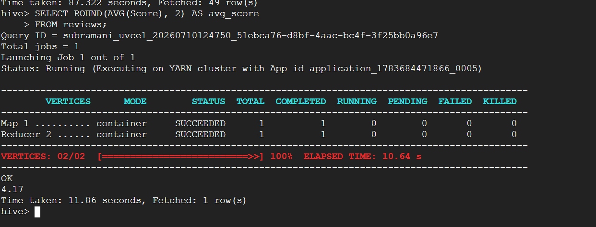

for this i have taken the exmaple one fo the query from the hive 



the output is looking like this 
-----------------------------------------------------------
Map 1 .......... container    SUCCEEDED    1    1    0    0    0    0
Reducer 2 ...... container    SUCCEEDED    1    1    0    0    0    0
-----------------------------------------------------------

Here m1 and m2 represents the map task in hive and r1 represents the reduce task in hive.

Hive is Just a SQL translator - it converts sql query into MapReduce Jobs that run on the cluster.

# How it works - Hive --> MapReduce
Your Hive SQL
      │
      ▼
  Hive Parser  (converts SQL → MapReduce plan)
      │
      ▼
  YARN / Hadoop (executes the MapReduce jobs)
      │
      ▼
  Result back to hive> prompt
## Map Phase vs Reduce Phase

| Phase      | What it does                                             | SQL Equivalent                        |
|------------|----------------------------------------------------------|---------------------------------------|
| **Map**    | Reads raw rows from HDFS block by block                  | `FROM reviews` (table scan)           |
| **Map**    | Extracts only the columns needed                         | `SELECT col1, col2`                   |
| **Map**    | Filters rows based on condition                          | `WHERE Score > 3`                     |
| **Map**    | Emits key-value pairs → sends to Reducer                 | Intermediate shuffle step             |
| **Reduce** | Receives all values grouped by the same key              | `GROUP BY ProductId`                  |
| **Reduce** | Aggregates — counts, sums, averages the grouped values   | `COUNT(*)`, `SUM()`, `AVG()`, `MAX()` |
| **Reduce** | Sorts the final aggregated output                        | `ORDER BY`                            |
| **Reduce** | Limits the final result set                              | `LIMIT 10`                            |

---

## Simple Rule to Remember

```
MAP    = Read  + Filter  + Extract   (per row, parallel across all nodes)
REDUCE = Group + Combine + Aggregate (final step, merges all mapper outputs)
```

# For my hive query in hadoop cluster

MAP : Reads the raw csv rows from HDFS, Extracts only the needed columns SQL equivalent : ```Select score from reviews``
MAP : Filters Rows : ```Where``` Clause
Map : Emits key-value pairs --> (key,value)  . it sends the data to reducer.
Reduce : Groups all values by the same key : ```GROUP BY```
Reduce : Aggregates -- counts, sums, averages the grouped values SQL Equivalent : COUNT(*), SUM(), AVG(), MAX()
Reduce : Sorts the final aggregated output : ```ORDER BY```
Reduce : Limits the final result set : ```LIMIT 10```
```
MAP    = Read  + Filter  + Extract   (per row, parallel across all nodes)
REDUCE = Group + Combine + Aggregate (final step, merges all mapper outputs)
```

## Tracing Your Exact Query Through MapReduce

Your query:SELECT productid,SUM( score ),COUNT(*)  FROM reviews  WHERE Score > 3  GROUP BY productid ORDER BY productid  LIMIT 10;

Input (HDFS CSV rows):
  1, B001E4KFG0, A3SGXH7AUHU8GW, ..., 5, ...
  2, B00813GRG4, A1D87F6ZCVE5NK, ..., 1, ...
  3, B000LQOCH0, ABXLMWJIXXAIN,  ..., 4, ...

Mapper reads each row → extracts only Score column:
  Emits → ("avg_key", 5)
  Emits → ("avg_key", 1)
  Emits → ("avg_key", 4)

REDUCE Phase (Reducer 2 in your screenshot):

Reducer receives all values grouped by key:
  ("avg_key", [5, 1, 4, 3, 5, 5, ...])

Reducer computes:
  SUM = 568,454
  COUNT = 568,454 rows... → AVG = 4.17

Output → 4.17

# Why 2 Vertices (Map 1 + Reducer 2)?
VERTICES: 02/02  [==========>>] 100%  ELAPSED TIME: 10.64 s

Vertex is nothing but a stage in the MapReduce job

In simple terms, think of a MapReduce job as a factory assembly line.

  Map Vertex = First assembly line (does initial work on every item independently)

  Reduce Vertex = Second assembly line (collects, groups, and finishes the work)

Vertex 01 : Map Tasks 1-8 (Reads data, filters rows, extracts columns)

Vertex 02 : Reducer Task 1 (Gathers all intermediate values, calculates final average, sorts, limits)


