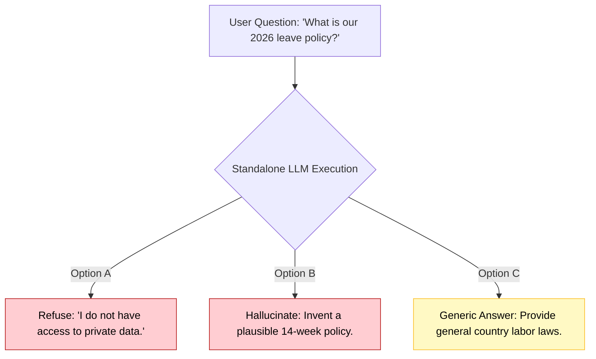
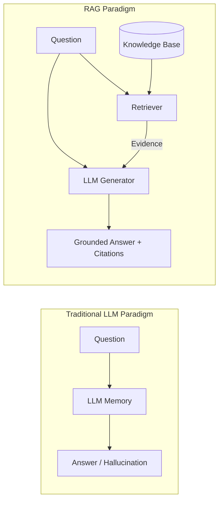
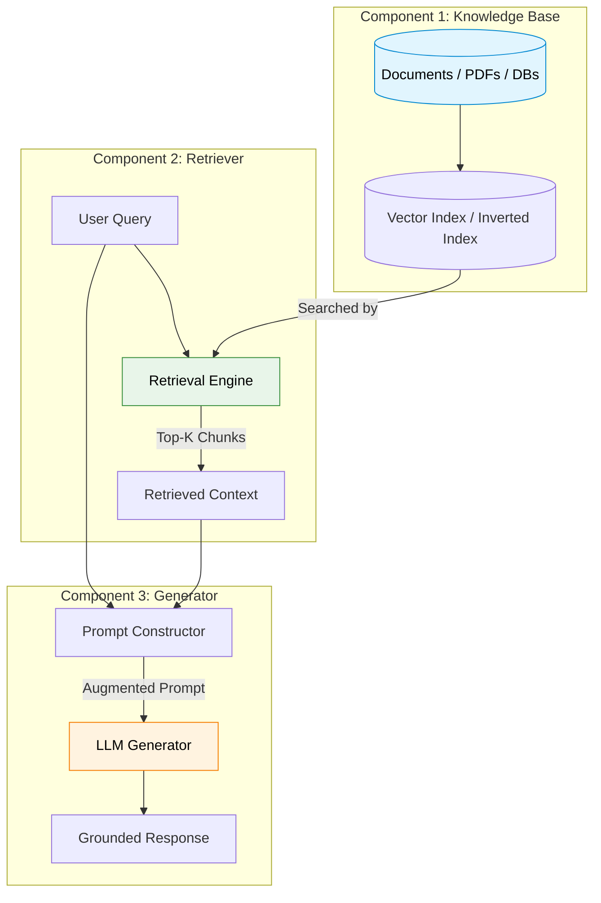
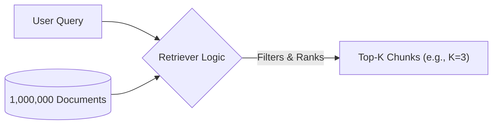
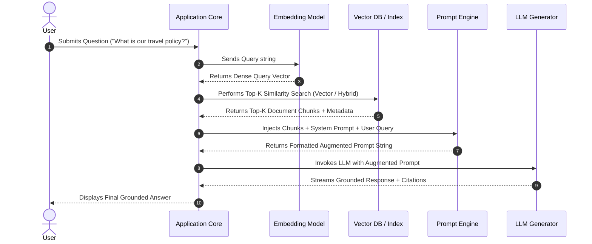
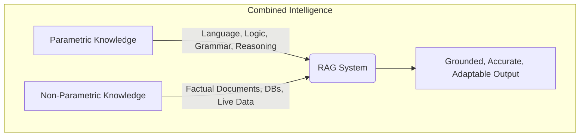
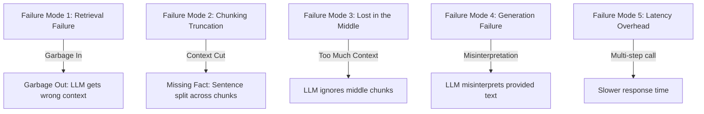
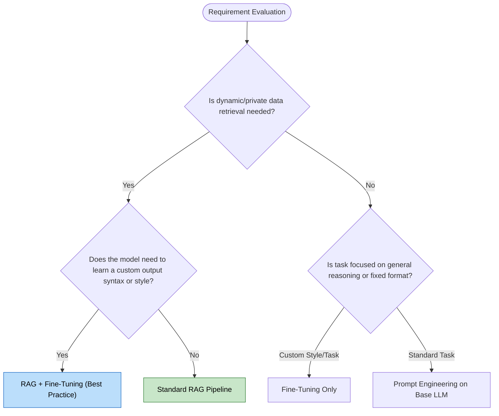

# Module 3 — The Birth of RAG

> **Author:** Subramani V  
> **Part of:** RAG Complete Learning Roadmap — PART 1: RAG Foundations  
> **Goal:** Understand what Retrieval-Augmented Generation (RAG) is, why it was invented, how its internal architecture works, the landmark 2020 Meta AI paper, and why RAG is the foundation of modern enterprise AI systems.

---

## Goal of this Module

By the end of this module, you will be able to answer with deep technical authority:

- What is Retrieval-Augmented Generation (RAG)?
- Why was RAG invented, and what fundamental LLM flaws does it solve?
- Who introduced RAG, and what were the key contributions of the 2020 landmark paper?
- How do the **Retriever**, **Generator**, and **Knowledge Base** interact internally?
- What is the difference between **RAG-Sequence** and **RAG-Token** formulations?
- How does RAG bridge **Parametric Memory** and **Non-Parametric Knowledge**?
- What are the distinct advantages, limitations, and failure modes of RAG?
- How does RAG compare against **Fine-Tuning** and **Long-Context Windows**?
- When should you build a RAG system vs other architectures?
- What are common misconceptions around RAG in the industry?

---

## Module Structure

```text
3.1  Why RAG Was Invented
3.2  The Original RAG Paper (Lewis et al., Meta AI 2020)
3.3  What Does "Retrieval-Augmented Generation" Mean?
3.4  Core Architecture & Components of RAG
3.5  The Knowledge Base (Non-Parametric Memory)
3.6  The Retriever (Information Retrieval Engine)
3.7  The Generator (Large Language Model)
3.8  End-to-End RAG Pipeline & Mechanics
3.9  RAG Formulations: RAG-Sequence vs RAG-Token
3.10 Why RAG Works: Bridging Knowledge Types
3.11 Parametric vs Non-Parametric Knowledge Matrix
3.12 Advantages of RAG
3.13 Limitations & Failure Modes of RAG
3.14 RAG vs Fine-Tuning vs Long-Context Windows
3.15 Decision Matrix: Choosing the Right Strategy
3.16 Conceptual Python Implementation from Scratch
3.17 Common Industry Misconceptions
3.18 Interview Questions & In-Depth Answers
```

---

## 3.1 — Why RAG Was Invented

In **Module 1**, we explored the severe limitations of relying solely on an LLM's parametric memory:

1. **Knowledge Cutoff:** Models are frozen in time post-training.
2. **Hallucinations:** LLMs generate plausible-sounding falsehoods when uncertain.
3. **Lack of Private Data:** Models cannot inspect internal corporate databases or confidential docs.
4. **Inability to Trace Sources:** Standard LLM outputs lack verifiable citations.
5. **Cost & Inefficiency of Retraining:** Fine-tuning or retraining to update facts is computationally prohibitive and prone to catastrophic forgetting.

### The Concrete Enterprise Problem

Imagine an enterprise deploying an LLM assistant for internal employees. An employee asks:

> *"What is our company's maternity leave and travel expense reimbursement policy for 2026?"*

A standalone LLM (e.g., GPT-4, Llama 3) faces a dilemma:



All three outcomes fail enterprise requirements. An enterprise needs **accurate, verifiable, grounded, and private answers**.

### The Breakthrough Paradigm Shift

Instead of expecting the LLM to memorize all the world's data inside its parameters, **what if we decouple knowledge storage from language generation?**



By retrieving relevant evidence from an external **Knowledge Base** first and supplying it alongside the user's prompt, the LLM acts as an **interpreter and synthesizer** rather than an unreliable memory vault.

This fundamental architectural insight gave birth to **Retrieval-Augmented Generation**.

---

## 3.2 — The Original RAG Paper (Lewis et al., Meta AI 2020)

While retrieval-guided generation concepts existed in various research forms, the formal term **Retrieval-Augmented Generation (RAG)** was officially introduced in the seminal 2020 research paper:

> **Paper Title:** *"Retrieval-Augmented Generation for Knowledge-Intensive NLP Tasks"*  
> **Authors:** Patrick Lewis, Ethan Perez, Aleksandros Piktus, Fabio Petroni, Vladimir Karpukhin, Naman Goyal, Heinrich Küttler, Mike Lewis, Wen-tau Yih, Tim Rocktäschel, Sebastian Riedel, Douwe Kiela  
> **Institutions:** Meta AI (Facebook AI Research), University College London (UCL), New York University (NYU)  
> **Published:** NeurIPS 2020

```text
                                  THE 2020 RAG PAPER
┌──────────────────────────────────────────────────────────────────────────────────┐
│                                                                                  │
│  "We build fine-tuned models that combine parametric memory with non-parametric  │
│   (index-based) memory through a general fine-tuning recipe for RAG."             │
│                                                                                  │
│   Key Setup in Paper:                                                            │
│   • Dense Retriever: Dense Passage Retriever (DPR) based on BERT                 │
│   • Generator: BART-large (a sequence-to-sequence transformer)                   │
│   • Non-Parametric Memory: Wikipedia dump indexed via MIPS (FAISS)              │
│                                                                                  │
└──────────────────────────────────────────────────────────────────────────────────┘
```

> [!NOTE]
> **Historical Context:** In 2020, autoregressive models like GPT-3 had just emerged, but fine-tuning massive models was difficult and vector databases were in their infancy. The paper demonstrated that equipping a seq2seq model (BART) with a neural retriever (DPR) achieved state-of-the-art results on open-domain QA (OpenBookQA, Natural Questions, TriviaQA) while generating far fewer hallucinations.

### Key Contributions of the Paper

1. **Hybrid Architecture:** Combined a pre-trained parametric memory model (BART) with a non-parametric memory access system (DPR over Wikipedia).
2. **End-to-End Differentiation:** Showed that the retriever and generator could be jointly trained/fine-tuned using backpropagation through the top-k retrieved documents.
3. **Probabilistic Formulations:** Introduced two distinct mathematical probabilistic formulations for generation: **RAG-Sequence** and **RAG-Token** (detailed in Section 3.9).
4. **Dynamic Knowledge Updating:** Proved that non-parametric memory could be updated at test time simply by replacing the underlying document index without retraining the model.

---

## 3.3 — What Does "Retrieval-Augmented Generation" Mean?

To understand RAG deeply, dissect its three constituent terms:

```text
┌─────────────────────────┬─────────────────────────┬─────────────────────────┐
│       RETRIEVAL         │        AUGMENTED        │       GENERATION        │
├─────────────────────────┼─────────────────────────┼─────────────────────────┤
│ Find and extract the    │ Attach the retrieved    │ Produce a fluent,       │
│ most relevant factual   │ context into the input  │ contextual answer using │
│ document passages from  │ prompt alongside the    │ the LLM's natural       │
│ an external corpus for  │ original user question  │ language reasoning      │
│ a given query.          │ to create a rich prompt.│ grounded on evidence.   │
└─────────────────────────┴─────────────────────────┴─────────────────────────┘
```

### 1. Retrieval
The system uses search techniques (lexical like BM25, or semantic like vector embeddings) to scan a target Knowledge Base and extract the $k$ most relevant text chunks given a query $q$.

### 2. Augmented
The extracted text chunks $z$ are merged into a structured prompt template alongside the original question $q$. The LLM's input context window is **augmented** with explicit, ground-truth evidence:

$$\text{Prompt} = \text{System Instruction} + \text{Retrieved Context } (z_1, z_2, \dots, z_k) + \text{User Question } (q)$$

### 3. Generation
The LLM processes this augmented prompt and autoregressively generates the response $y$. Because the model relies on the provided context $z$, it acts as an evidence-grounded writer rather than guessing from its internal parameters.

> [!IMPORTANT]
> **RAG is still Generation:** RAG does not simply copy-paste retrieved lines. The generator rewrites, synthesizes, formats, compares, and explains the retrieved information into a coherent answer tailored to the user's intent.

---

## 3.4 — Core Architecture & Components of RAG

At an architectural level, every RAG system consists of **three primary components**:



---

## 3.5 — Component 1: The Knowledge Base (Non-Parametric Memory)

The **Knowledge Base** is the external repository containing truth data. Unlike parametric memory stored in neural weights, the Knowledge Base is stored externally in files, indexes, databases, or object stores.

### Data Types in Knowledge Bases
- **Unstructured:** PDF reports, Word documents, Markdown files, HTML web pages, raw text logs.
- **Semi-Structured:** JSON, XML, Markdown tables, CSVs, YAML configs.
- **Structured:** Relational SQL databases, Graph databases (Neo4j), Key-Value stores.
- **Dynamic Sources:** Live API feeds, Slack channels, Notion workspaces, Git repositories.

### Key Characteristic: Hot-Swappable Memory
If corporate policy changes tomorrow (e.g., casual leaves change from 12 to 15), you update **one document** in the Knowledge Base. There is **zero necessity to retrain, fine-tune, or redeploy** the LLM.

---

## 3.6 — Component 2: The Retriever (Information Retrieval Engine)

The **Retriever** acts as the filter between the vast Knowledge Base and the LLM's limited context window.

```text
Input:  User Query (q) + Knowledge Base (D)
Task:   Score and select Top-K passage chunks (z_1, z_2, ..., z_k) where k << |D|
Output: Context passages z
```



### Types of Retrievers
1. **Lexical Retriever (Sparse):** BM25, TF-IDF, Keyword search (matches exact term occurrences).
2. **Dense Retriever (Semantic):** Neural embedding models (Bi-Encoders) mapping queries and passages into dense vector spaces, searching via Cosine Similarity / Dot Product.
3. **Hybrid Retriever:** Combines sparse (BM25) and dense (Vector) retrieval with rank fusion algorithms like Reciprocal Rank Fusion (RRF).

> [!WARNING]
> **The Retriever Non-Equivalence:** The Retriever is **NOT** an LLM. It is an Information Retrieval algorithm or smaller encoder model designed specifically for high-speed search across millions of documents in milliseconds.

---

## 3.7 — Component 3: The Generator (Large Language Model)

The **Generator** is an autoregressive Transformer language model (e.g., GPT-4o, Claude 3.5 Sonnet, Llama 3, Mistral, Qwen).

### Role of the Generator:
- Parses the user question alongside the context passages.
- Distills relevant details and ignores irrelevant noise present in the retrieved passages.
- Resolves conflicting information across multiple retrieved passages.
- Formulates a fluent, structured, and syntactically correct response in the requested tone/format.

### Input-Output Contract of the Generator

```text
PROMPT TEMPLATE:
----------------------------------------------------------------------
You are a helpful enterprise assistant. Answer the user's question based 
ONLY on the provided context passages below. If the context does not 
contain enough information, state "I cannot answer based on the provided documents."

CONTEXT PASSAGES:
[Passage 1]: HR Policy Section 4.2: Casual leave quota is set to 12 days annually.
[Passage 2]: HR Policy Section 4.3: Unused casual leaves expire on Dec 31st.

USER QUESTION:
How many casual leaves do I get every year, and do they carry over?

RESPONSE:
----------------------------------------------------------------------
According to Section 4.2 of the HR Policy, employees receive 12 casual 
leaves annually. As noted in Section 4.3, unused casual leaves do not 
carry over and expire on December 31st.
```

---

## 3.8 — End-to-End RAG Pipeline & Mechanics

Let's walk through the exact 8-step lifecycle of a RAG transaction:



### Detailed Breakdown of Steps

1. **Query Submission:** User submits a natural language question $q$.
2. **Query Preprocessing & Transformation:** Optional step where the query is cleaned, expanded, or converted into embedding vectors.
3. **Index Querying:** The retriever compares the query representation against the indexed Knowledge Base.
4. **Candidate Fetching (Top-K Retrieval):** The $k$ highest-scoring chunks (e.g., $k=3$ to $5$) are fetched along with metadata (document title, page number, URL).
5. **Prompt Assembly (Context Augmentation):** A prompt template merges system instructions, candidate context chunks, metadata citations, and the original question into a single input context.
6. **LLM Forward Pass (Generation):** The LLM generates token by token, conditioning each token probability on both the prompt context and prior generated tokens.
7. **Post-Processing & Safety Checking:** Output is checked for compliance, citations are formatted, and guardrails verify that generation adheres to context.
8. **Final Output Delivery:** User receives a polished response complete with traceable references.

---

## 3.9 — RAG Formulations: RAG-Sequence vs RAG-Token

In the original 2020 Meta AI paper, Lewis et al. proposed two probabilistic formulations for how retrieved documents condition generation:

```text
                                  RAG FORMULATIONS
┌──────────────────────────────────────────────────────────────────────────────────┐
│                                                                                  │
│   1. RAG-Sequence Model                                                          │
│      • Uses the SAME retrieved document to generate the ENTIRE answer sequence.  │
│      • Marginalizes over top-k documents at the sequence level.                 │
│                                                                                  │
│   2. RAG-Token Model                                                             │
│      • Can SWITCH retrieved documents for EACH INDIVIDUAL TOKEN in the response. │
│      • Marginalizes over top-k documents at the token level.                    │
│                                                                                  │
└──────────────────────────────────────────────────────────────────────────────────┘
```

### 1. RAG-Sequence Model
The model retrieves top-$k$ documents $z$. For each document $z_i$, it generates the complete target sequence $y = (y_1, y_2, \dots, y_N)$. The marginal probability of generating output sequence $y$ given query $x$ is the sum of probabilities across each document:

$$P_{\text{RAG-Sequence}}(y \mid x) \approx \sum_{z \in \text{Top-K}} P_{\eta}(z \mid x) \prod_{i=1}^{N} P_{\theta}(y_i \mid x, z, y_{1:i-1})$$

- **Best for:** Query-focused summarization, cohesive passage generation where a single document provides the full answer context.

### 2. RAG-Token Model
The model evaluates top-$k$ documents for *each token* generated. It allows the model to draw token $y_1$ based on passage $z_1$, token $y_2$ based on passage $z_2$, and so on:

$$P_{\text{RAG-Token}}(y \mid x) \approx \prod_{i=1}^{N} \sum_{z \in \text{Top-K}} P_{\eta}(z \mid x) P_{\theta}(y_i \mid x, z, y_{1:i-1})$$

- **Best for:** Synthesizing complex answers that require combining distinct facts from multiple separate sources (e.g., comparing features across three different product datasheets).

---

## 3.10 — Why RAG Works: Bridging Knowledge Types

To grasp why RAG is fundamentally effective, we must analyze the two forms of knowledge inside an AI system:



- **Parametric Knowledge:** Encoded permanently inside the model's weights during pre-training. It gives the LLM reasoning, language syntax, instruction following, and broad world concepts.
- **Non-Parametric Knowledge:** Stored outside the model in text files, databases, or vector indices. It contains specific, changing, or private domain facts.

When combined via RAG, the system utilizes **Parametric Memory for reasoning capability** and **Non-Parametric Memory for factual grounding**.

---

## 3.11 — Parametric vs Non-Parametric Knowledge Matrix

| Feature | Parametric Knowledge (LLM Weights) | Non-Parametric Knowledge (RAG Index) |
| :--- | :--- | :--- |
| **Storage Location** | Deep neural network matrices ($\mathbf{W}$) | External Vector DB, Inverted Index, DB |
| **Update Mechanism** | Expensive re-training or fine-tuning | Instant CRUD document update |
| **Data Freshness** | Frozen at training cutoff date | Real-time / Up-to-the-second |
| **Verification & Citation** | Impossible (black-box weights) | Direct (exact document page/line link) |
| **Hallucination Risk** | High when data is obscure or missing | Low (grounded on retrieved text) |
| **Access Control & Security**| Hard (all weights accessed equally) | Easy (Role-Based Access Control / RBAC) |
| **Cost to Maintain** | Massive GPU cluster costs | Modest database storage costs |

---

## 3.12 — Advantages of RAG

```text
┌──────────────────────────────────────────────────────────────────────────────────┐
│                                ADVANTAGES OF RAG                                 │
├───────────────────────────────────┬──────────────────────────────────────────────┤
│ 1. Up-to-Date / Fresh Knowledge  │ Access current data without retraining       │
│ 2. Hallucination Reduction        │ Answers are anchored in explicit evidence    │
│ 3. Verifiability & Trust          │ Provides source citations for auditing       │
│ 4. Privacy & Access Control       │ Enforce RBAC before context generation       │
│ 5. Extreme Cost Efficiency        │ Document updates cost pennies vs $100k+ tune │
│ 6. Modular Maintainability        │ Swap retriever, generator, or DB independently│
└───────────────────────────────────┴──────────────────────────────────────────────┘
```

1. **Elimination of Knowledge Cutoff:** Connect your model to live databases or daily document updates.
2. **Drastic Hallucination Reduction:** Restricting the model to answer based *only* on context significantly curbs factual fabrication.
3. **Explainability & Source Citation:** Every claim made by the LLM can be mapped back to `Document_A.pdf, Page 12`.
4. **Data Security & Fine-Grained Permissions:** RAG retrievers can inspect user permissions (RBAC) and filter out documents the user is not authorized to see *before* building the prompt.
5. **Cost-Effective Scalability:** Adding 1,000,000 new enterprise PDFs requires adding vector index rows, not re-running backpropagation on billions of parameters.

---

## 3.13 — Limitations & Failure Modes of RAG

Despite its power, RAG is not magic. Understanding its failure modes is critical for production engineers:



### 1. "Garbage In, Garbage Out" (Retrieval Failure)
If the retriever returns irrelevant or noise-filled passages, the LLM will either fail to answer or synthesize incorrect claims.

### 2. Chunking Cut-off Errors
If an essential entity relationship spans across two paragraphs, an improper chunking strategy might split them into separate chunks, rendering both incomplete.

### 3. "Lost in the Middle" Phenomenon
Research (Liu et al., 2023) shows LLMs pay high attention to text at the very beginning and very end of long input prompts, but frequently overlook facts placed in the **middle** of a large retrieved context window.

### 4. Generation Misinterpretation
Even with correct context, the LLM can misinterpret complex tables, double negatives, or ambiguous policy statements.

### 5. Increased System Latency
A RAG pipeline introduces extra network roundtrips:
$$\text{Total Latency} = T_{\text{Embed}} + T_{\text{Retrieval}} + T_{\text{Prompt Prep}} + T_{\text{LLM First Token}} + T_{\text{LLM Generation}}$$

---

## 3.14 — RAG vs Fine-Tuning vs Long-Context Windows

Developers often ask: *"Should I use RAG, Fine-Tuning, or just feed everything into a 2-Million Token LLM Context Window?"*

Here is the definitive architectural comparison:

| Attribute | RAG (Retrieval-Augmented) | Fine-Tuning (PEFT / LoRA) | Long-Context LLMs (e.g. Gemini 1.5 Pro) |
| :--- | :--- | :--- | :--- |
| **Primary Purpose** | Fetching & Grounding on external data | Teaching **Style, Tone, Format, & Task Behavior** | In-context processing of large single documents |
| **Knowledge Update** | Instant (Update DB index) | Slow (Re-train with new dataset) | Transient (Passed in per request) |
| **Hallucination Rate** | Low | Medium-High | Low-Medium |
| **Data Privacy (RBAC)**| Excellent (Filter at index level) | Poor (Hard to un-learn fine-tuned data)| Moderate (Data in payload) |
| **Cost per Query** | Low to Medium | Low | **Very High** (Paying for 1M input tokens per query) |
| **Latency** | Medium (Retrieval + Gen) | Low (Direct Gen) | High (Processing millions of tokens) |
| **Source Citation** | Native & Direct | Impossible | Manual extraction |

---

## 3.15 — Decision Matrix: Choosing the Right Strategy



> [!TIP]
> **Rule of Thumb:**
> - Need to **know** something new? $\rightarrow$ **Use RAG.**
> - Need to **act/format** in a specific way? $\rightarrow$ **Use Fine-Tuning.**
> - Need **both**? $\rightarrow$ **Combine RAG with a Fine-Tuned Model.**

---

## 3.16 — Conceptual Python Implementation from Scratch

To demonstrate that RAG is an architecture rather than magic, here is a complete, dependency-free conceptual implementation in pure Python:

```python
"""
Conceptual RAG Pipeline from Scratch
Exemplifying Knowledge Base, Lexical Retriever, Prompt Augmentation, and Mock Generator.
"""

import math
import re
from typing import List, Dict

# ==========================================
# 1. THE KNOWLEDGE BASE (Non-Parametric)
# ==========================================
KNOWLEDGE_BASE = [
    {
        "id": "doc_1",
        "title": "HR Leave Policy",
        "content": "Employees are entitled to 12 casual leaves and 10 sick leaves annually. Unused casual leaves expire on December 31st."
    },
    {
        "id": "doc_2",
        "title": "Travel & Expense Guide",
        "content": "Business flights under 5 hours must be booked in Economy class. Daily meal allowance is capped at $75 per day."
    },
    {
        "id": "doc_3",
        "title": "IT Security Protocols",
        "content": "Passwords must be changed every 90 days. Multi-Factor Authentication (MFA) is mandatory for VPN access."
    }
]

# ==========================================
# 2. THE RETRIEVER (Simple TF-IDF / Overlap)
# ==========================================
class SimpleRetriever:
    def __init__(self, corpus: List[Dict]):
        self.corpus = corpus

    def _tokenize(self, text: str) -> List[str]:
        return re.findall(r'\w+', text.lower())

    def retrieve(self, query: str, top_k: int = 1) -> List[Dict]:
        query_tokens = set(self._tokenize(query))
        scores = []

        for doc in self.corpus:
            doc_tokens = set(self._tokenize(doc["content"]))
            # Overlap Score
            score = len(query_tokens.intersection(doc_tokens))
            scores.append((score, doc))

        # Sort by relevance score descending
        scores.sort(key=lambda x: x[0], reverse=True)
        return [doc for score, doc in scores[:top_k] if score > 0]

# ==========================================
# 3. THE GENERATOR (Mocked LLM Engine)
# ==========================================
class MockLLMGenerator:
    def generate(self, augmented_prompt: str) -> str:
        # Simulating LLM generating an answer based on prompt instructions
        if "casual leaves" in augmented_prompt.lower():
            return "Based on the HR Leave Policy, employees receive 12 casual leaves per year, which expire on December 31st."
        elif "meal allowance" in augmented_prompt.lower():
            return "According to the Travel & Expense Guide, the daily meal allowance is capped at $75 per day."
        else:
            return "I cannot answer this question based on the provided document context."

# ==========================================
# 4. PIPELINE EXECUTION
# ==========================================
def run_rag_pipeline(user_query: str):
    print(f"\n--- RAG TRANSACTION START ---")
    print(f"USER QUERY: '{user_query}'")

    # Step A: Retrieve
    retriever = SimpleRetriever(KNOWLEDGE_BASE)
    retrieved_docs = retriever.retrieve(user_query, top_k=1)

    if not retrieved_docs:
        context_str = "No relevant context found."
    else:
        context_str = "\n".join([f"[{doc['title']}]: {doc['content']}" for doc in retrieved_docs])

    print(f"\n[1] RETRIEVED CONTEXT:\n{context_str}")

    # Step B: Augment Prompt
    augmented_prompt = f"""
    SYSTEM INSTRUCTION: Answer the question using ONLY the provided context below.
    
    CONTEXT:
    {context_str}
    
    QUESTION:
    {user_query}
    
    ANSWER:
    """
    print(f"\n[2] AUGMENTED PROMPT CONSTRUCTED (Length: {len(augmented_prompt)} chars)")

    # Step C: Generate
    generator = MockLLMGenerator()
    response = generator.generate(augmented_prompt)

    print(f"\n[3] GENERATED RESPONSE:\n{response}")
    print(f"--- RAG TRANSACTION END ---\n")

# Run Example Queries
if __name__ == "__main__":
    run_rag_pipeline("How many casual leaves do I get each year?")
    run_rag_pipeline("What is the daily meal allowance for travel?")
```

---

## 3.17 — Common Industry Misconceptions

### Misconception 1: *"RAG is a single model or algorithm."*
❌ **False.** RAG is a composite **system architecture**. It combines document loaders, splitters, embedders, vector databases, retrieval logic, prompt rankers, and an LLM generator.

### Misconception 2: *"RAG completely eliminates hallucinations."*
❌ **False.** RAG *dramatically reduces* hallucinations by supplying explicit evidence. However, if the LLM hallucinates logic, misinterprets ambiguous sentences, or synthesizes across conflicting sources incorrectly, errors can still occur.

### Misconception 3: *"RAG requires a Vector Database."*
❌ **False.** Retrieval can be performed using BM25 over Lucene/Elasticsearch, SQL databases, Knowledge Graphs, Web APIs, or hybrid combinations. Vector search is common for semantic matching, but it does not define RAG.

### Misconception 4: *"RAG replaces the need for fine-tuning."*
❌ **False.** RAG provides **knowledge**. Fine-tuning provides **behavior, style, syntax, and task alignment**. Production systems often use fine-tuned lightweight models operating inside a RAG pipeline.

---

## 3.18 — Interview Questions & In-Depth Answers

### Q1: What is Retrieval-Augmented Generation (RAG) and why was it invented?
**Answer:**  
RAG is an AI system architecture that combines an Information Retrieval system with an autoregressive Large Language Model. It was invented to overcome fundamental limitations of parametric memory in LLMs—namely knowledge cutoffs, inability to access private/proprietary data, hallucinations, lack of citations, and the prohibitive cost of continuous model re-training.

---

### Q2: Explain the roles of the Knowledge Base, Retriever, and Generator.
**Answer:**  
- **Knowledge Base:** External storage (non-parametric memory) holding truth documents, indexed for fast searching.
- **Retriever:** Search component that accepts a query and fetches the top-$k$ most relevant document passages from the Knowledge Base.
- **Generator:** An LLM that accepts the user query alongside the retrieved passages (augmented prompt) and synthesizes a grounded natural language response.

---

### Q3: What is the difference between Parametric and Non-Parametric knowledge?
**Answer:**  
Parametric knowledge is frozen into the model's neural network weights during pre-training. It is static, difficult to edit, and hard to inspect. Non-Parametric knowledge resides in external data sources (indices, databases). It can be updated instantly in real time without updating model weights, supports access control, and provides traceable citations.

---

### Q4: Compare RAG-Sequence and RAG-Token formulations introduced by Lewis et al. (2020).
**Answer:**  
- **RAG-Sequence:** Retrieves a set of top-$k$ documents for a query and uses the *same single document* to generate the entire output response, marginalizing across documents over the sequence.
- **RAG-Token:** Evaluates and can switch between different retrieved documents for *each generated token* in the response, allowing multi-document synthesis within a single answer.

---

### Q5: What is the "Garbage In, Garbage Out" problem in RAG?
**Answer:**  
If the retriever component fails to fetch relevant context (due to poor embeddings, bad chunking, or keyword mismatch), the generator receives noise or irrelevant text. As a result, the generator either refuses to answer or produces an ungrounded hallucination based on inadequate context.

---

### Q6: How do you choose between RAG, Fine-Tuning, and Long-Context Windows?
**Answer:**  
- Choose **RAG** when accessing dynamic, fast-changing, or private data that requires exact citations and low hallucination rates.
- Choose **Fine-Tuning** when teaching the model a specific format, voice, task syntax, or domain-specific language behavior.
- Choose **Long-Context** for one-off analyses of single long documents where retrieving sub-chunks breaks global understanding and cost is secondary.
- Use **RAG + Fine-Tuning** together in enterprise applications requiring both specialized behavior and dynamic factual grounding.

---

## Summary & Key Takeaways

```text
┌──────────────────────────────────────────────────────────────────────────────────┐
│                                KEY TAKEAWAYS                                     │
├──────────────────────────────────────────────────────────────────────────────────┤
│ • RAG decouples Knowledge Storage (Retriever) from Language Generation (LLM).    │
│ • Introduced by Meta AI in 2020 (Lewis et al.) using DPR + BART.                 │
│ • Tri-component architecture: Knowledge Base → Retriever → Generator (LLM).       │
│ • Solves knowledge cutoff, private data access, and hallucination issues.         │
│ • Parametric Memory (weights) + Non-Parametric Memory (docs) = RAG.              │
│ • RAG is an ARCHITECTURE, not a single model or vector database.                  │
└──────────────────────────────────────────────────────────────────────────────────┘
```

---

## What's Next?

Now that you understand **WHY** RAG exists and **HOW** its architecture functions high-level, we are ready for the core engine of modern semantic retrieval:

### ➡️ **Module 4 — Embeddings (The Heart of Modern RAG)**

In Module 4, we will dive deep into:
- What embeddings are mathematically (dense numerical vectors).
- How text is mapped into vector space.
- Cosine similarity, dot product, and Euclidean distance formulas.
- How models represent semantic meaning (why "king - man + woman = queen").
- Bi-Encoder vs Cross-Encoder architectures.
