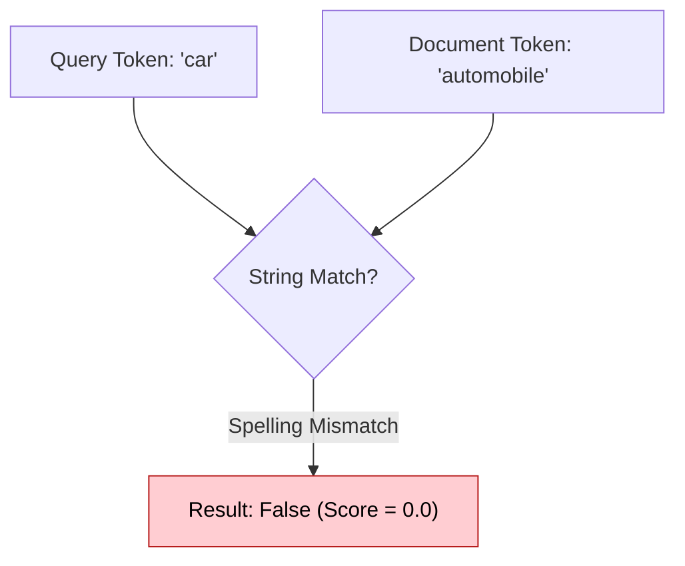
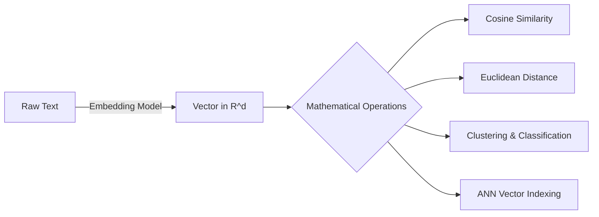
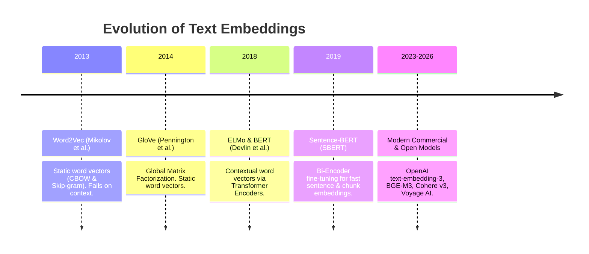
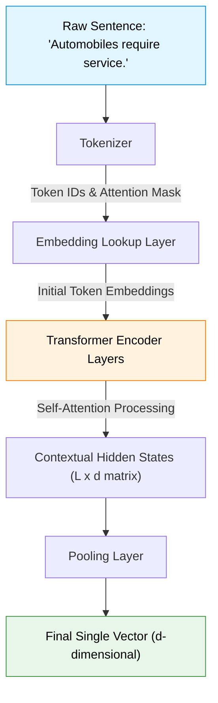
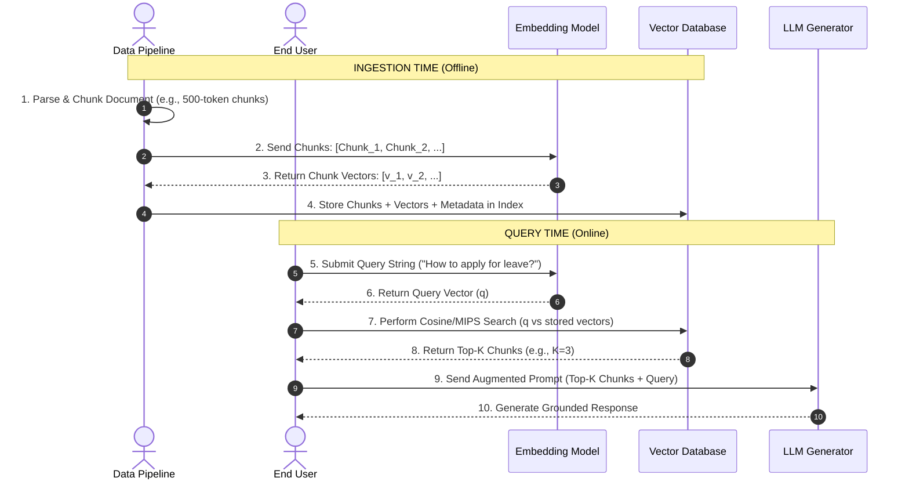

# Module 4 — Embeddings (The Heart of Modern RAG)

> **Author:** Subramani V  
> **Part of:** RAG Complete Learning Roadmap — PART 2: Embeddings  
> **Goal:** Master embeddings from core intuition and high-dimensional linear algebra to transformer encoder mechanics, pooling strategies, similarity metrics, contrastive learning, and production RAG workflows.

---

## Why This Module Matters

If someone deeply understands **Embeddings**, then **Vector Databases, Semantic Search, Hybrid Search, Dense Retrieval, Reranking, ANN Indexing, GraphRAG, and Agentic RAG** become natural and intuitive.

> **Embeddings are to RAG what Transformers are to LLMs.**

Without embeddings, computers can only compare strings of characters. With embeddings, computers can compute, compare, and reason about **semantic meaning**.

---

## Goal of this Module

By the end of this module, you will be able to answer with deep technical authority:

- What is an embedding, and why do we convert text into numerical vectors?
- Why does traditional keyword search fail on synonyms, paraphrases, and context?
- What is a high-dimensional vector space, and how do similar concepts form clusters within it?
- What are the mathematical formulas, geometric interpretations, and trade-offs of **Euclidean Distance**, **Cosine Similarity**, and **Dot Product**?
- How do Transformer Encoders generate contextual embeddings?
- What is the difference between `[CLS]` token pooling, Mean Pooling, and Max Pooling?
- What is the difference between **Bi-Encoders** and **Cross-Encoders**?
- How are embedding models trained using **Contrastive Learning**, **Triplet Loss**, and **InfoNCE Loss**?
- How are embeddings evaluated using benchmarks like **MTEB** (Massive Text Embedding Benchmark)?
- How do embeddings function inside an end-to-end RAG retrieval pipeline?

---

## Module Structure

```text
PART A — Foundations & Intuition
  4.1  Why Were Embeddings Invented?
  4.2  The Problem with Keyword Search
  4.3  What is an Embedding?
  4.4  Why Convert Text into Numbers?
  4.5  Feature Representation & Latent Dimensions

PART B — Vector Algebra & High-Dimensional Geometry
  4.6  Vector Basics & Notation
  4.7  Dimensions & Dimensionality
  4.8  High-Dimensional Vector Space
  4.9  Curse of Dimensionality vs. Blessing of High Dimensions
  4.10 Semantic Clustering & Topology

PART C — Distance & Similarity Metrics
  4.11 Why We Need Mathematical Similarity Metrics
  4.12 Euclidean Distance (L2 Norm)
  4.13 Cosine Similarity (The RAG Standard)
  4.14 Dot Product (Inner Product)
  4.15 Manhattan Distance (L1 Norm)
  4.16 Comprehensive Similarity Metric Comparison

PART D — Embedding Generation & Transformer Architecture
  4.17 Evolution: Word2Vec & GloVe to Contextual Embeddings
  4.18 How Transformer Embeddings Work (Tokenization -> Encoder -> Hidden States)
  4.19 Contextual Representations (Resolving Polysemy)
  4.20 Pooling Strategies: [CLS], Mean Pooling, Max Pooling
  4.21 Bi-Encoders vs. Cross-Encoders
  4.22 Training Embedding Models: Contrastive Learning & InfoNCE Loss
  4.23 Types of Embeddings (Word, Sentence, Document, Chunk, Query, Cross-Modal)
  4.24 Popular Embedding Models & The MTEB Benchmark

PART E — Embeddings in Production RAG
  4.25 End-to-End RAG Embedding & Retrieval Workflow
  4.26 Advantages of Embeddings in RAG
  4.27 Limitations, Edge Cases, & Failure Modes
  4.28 Fine-Tuning Embedding Models & Domain Adaptation
  4.29 Conceptual Python Implementation from Scratch
  4.30 Common Industry Misconceptions
  4.31 Interview Questions & In-Depth Answers
  4.32 Deep Dive Preview: Opening the Encoder Black Box
```

---

# PART A — Foundations & Intuition

## 4.1 — Why Were Embeddings Invented?

Let's begin with a fundamental problem in computer science.

Suppose your enterprise knowledge base contains this document:

```text
DOCUMENT PASSAGE:
"Automobiles require regular oil changes and engine maintenance."
```

Now, a user submits the following search query:

```text
USER QUERY:
"How do I repair my car?"
```

Should this document passage be retrieved?

As humans, we immediately answer **YES**. We instantly know that:

$$\text{Car} \approx \text{Automobile}$$

$$\text{Repair} \approx \text{Maintenance}$$

Now consider how a classic computer program evaluates this query against the document:



To a computer, `"car"` is represented in memory as ASCII/UTF-8 bytes `[0x63, 0x61, 0x72]`. `"automobile"` is `[0x61, 0x75, 0x74, 0x6F, ...]`.

Because the character sequences do not match, string comparison algorithms (and exact keyword search engines) declare them completely unrelated!

### Real-World Analogy
Imagine telling a friend: *"Please fetch me a couch."*  
Your friend responds: *"I cannot find a couch, I only see a sofa."*

Humans understand that **sofa** and **couch** refer to the same physical object. Traditional computer algorithms do not. **Embeddings were invented to bridge this semantic gap.**

---

## 4.2 — The Problem with Keyword Search

In **Module 2**, we studied **Information Retrieval (IR)** using algorithms like **TF-IDF** and **BM25**.

While BM25 is fast and efficient, it suffers from three structural weaknesses:

```text
                               KEYWORD SEARCH LIMITATIONS
┌─────────────────────────┬─────────────────────────┬─────────────────────────┐
│     SYNONYM BLINDNESS   │  VOCABULARY MISMATCH    │   CONTEXT IGNORED       │
├─────────────────────────┼─────────────────────────┼─────────────────────────┤
│ Fails when query and    │ Users express concepts  │ Cannot distinguish word │
│ document use different  │ differently than policy │ meanings based on       │
│ words for same concept. │ document writers.       │ surrounding sentence.   │
└─────────────────────────┴─────────────────────────┴─────────────────────────┘
```

1. **Synonym Blindness:** `"Heart attack"` vs. `"Myocardial infarction"`. A medical document containing "Myocardial infarction" will score $0$ for a query searching for "Heart attack" in pure lexical search.
2. **Vocabulary Mismatch:** Enterprise employees write queries in informal slang, while internal HR policies use formal legal jargon.
3. **Context Sensitivity:** Consider the word `"bank"`:
   - *"He sat by the river **bank**."* (Geography)
   - *"She deposited money into her **bank** account."* (Finance)

Keyword search treats `"bank"` identically in both sentences.

---

## 4.3 — What is an Embedding?

Here is the formal technical definition:

> **Definition:** An **embedding** is a dense, continuous numerical vector representation of data (text, images, audio) in a high-dimensional vector space, where semantically similar items are mapped to nearby mathematical coordinates.

```text
                     TEXT TO DENSE VECTOR MAPPING
┌───────────────────────┐                  ┌─────────────────────────────────┐
│      Input Text       │                  │       Dense Vector Output       │
├───────────────────────┤                  ├─────────────────────────────────┤
│ "Cat"                 │  ───────►───────  │ [ 0.12, -0.42,  0.81, ..., 0.05] │
│ "Dog"                 │  ───────►───────  │ [ 0.10, -0.40,  0.79, ..., 0.03] │
│ "Automobile"          │  ───────►───────  │ [-0.92,  0.63, -0.14, ..., 0.88] │
└───────────────────────┘                  └─────────────────────────────────┘
```

Notice the key observation:
- The vector for `"Cat"` and `"Dog"` share very similar floating-point values across dimensions.
- The vector for `"Automobile"` resides in a completely different numerical region.

> [!IMPORTANT]
> **Key Rule of Embeddings:** Embeddings capture **semantic meaning**, not spelling or character arrangement.

---

## 4.4 — Why Convert Text into Numbers?

A common interview question is:

> *"Why can't we perform semantic search directly on natural language strings?"*

**Answer:**  
Computers, GPUs, Linear Algebra units, and Neural Networks cannot execute mathematical operations on raw text strings. 

By converting natural language into numerical vectors $\mathbf{v} \in \mathbb{R}^d$, we unlock the power of **Linear Algebra and High-Dimensional Geometry**:



Once text is represented as vectors, finding "relevant information" reduces to **finding the nearest vector in space** using geometric calculations.

---

## 4.5 — Feature Representation & Latent Dimensions

To understand how vectors capture meaning, imagine hand-crafting features for words across 4 dimensions:

| Word | Dimension 1: Is Animal? | Dimension 2: Is Pet? | Dimension 3: Has Wheels? | Dimension 4: Is Food? |
| :--- | :---: | :---: | :---: | :---: |
| **Cat** | `0.95` | `0.90` | `0.01` | `0.05` |
| **Dog** | `0.98` | `0.95` | `0.01` | `0.02` |
| **Car** | `0.00` | `0.00` | `0.99` | `0.00` |
| **Pizza**| `0.02` | `0.00` | `0.00` | `0.97` |

If we plot these 4-dimensional coordinates:
- `Cat` `[0.95, 0.90, 0.01, 0.05]` and `Dog` `[0.98, 0.95, 0.01, 0.02]` are almost identical.
- `Car` and `Pizza` are far apart from `Cat`.

### From Hand-Crafted to Latent Dimensions
In modern neural networks (like BERT or OpenAI embeddings), dimensions are **not** manually assigned to human concepts like "Is Animal". Instead, the model learns hundreds or thousands of **latent (hidden) mathematical dimensions** automatically during self-supervised training on billions of text sentences.

---

# PART B — Vector Algebra & High-Dimensional Geometry

## 4.6 — Vector Basics & Notation

In mathematics, a **vector** is an ordered sequence of numbers.

A $d$-dimensional column vector $\mathbf{v}$ is written as:

$$\mathbf{v} = \begin{bmatrix} v_1 \\ v_2 \\ \vdots \\ v_d \end{bmatrix} \in \mathbb{R}^d \quad \text{or as a transposed row vector} \quad \mathbf{v}^T = [v_1, v_2, \dots, v_d]$$

Where:
- $d$ represents the **dimensionality** of the embedding space.
- $v_i \in \mathbb{R}$ represents the continuous floating-point coordinate along dimension $i$.

---

## 4.7 — Dimensions & Dimensionality

The **dimensionality** of an embedding vector refers to the number of numerical values (components) it contains.

```text
Vector A (3-Dimensional):
[0.25, -0.81, 0.44]

Vector B (768-Dimensional - e.g., bert-base-uncased / all-MiniLM-L6-v2):
[0.012, -0.045, 0.381, ..., -0.109]  <-- 768 floating point numbers

Vector C (1536-Dimensional - e.g., OpenAI text-embedding-3-small):
[-0.023, 0.011, 0.089, ..., 0.041]   <-- 1536 floating point numbers

Vector D (3072-Dimensional - e.g., OpenAI text-embedding-3-large):
[0.004, -0.019, 0.052, ..., -0.012]  <-- 3072 floating point numbers
```

> [!NOTE]
> Higher dimensionality allows an embedding model to represent finer semantic nuances, but increases storage memory and search computational latency in Vector Databases.

---

## 4.8 — High-Dimensional Vector Space

We can easily visualize vectors in 2D ($x, y$) or 3D ($x, y, z$):

```text
         y (Dimension 2)
         ▲
         │       • Cat [0.8, 0.9]
         │     • Dog [0.75, 0.85]
         │
         │
         │                              • Car [-0.7, 0.3]
         └──────────────────────────────────► x (Dimension 1)
```

While humans cannot visually picture a 768-dimensional or 1536-dimensional space, the **linear algebra rules of 2D/3D geometry hold identically in $d$-dimensional space.**

Distance, vector addition, scalar multiplication, projections, and angles are computed using the exact same formulas regardless of whether $d=2$ or $d=3072$.

---

## 4.9 — The Curse of Dimensionality vs. The Blessing of High Dimensions

### The Curse of Dimensionality
As the number of dimensions $d$ grows:
1. The volume of the vector space grows exponentially ($V \propto r^d$).
2. Data becomes extremely sparse.
3. In very high dimensions, the distance between any two random vectors tends to converge to approximately the same value, making raw distance metric comparisons less sensitive if not normalized.

### The Blessing of High Dimensions
For text embeddings, high-dimensional spaces provide **massive semantic capacity**. Millions of distinct concepts, nuanced relationships, domain jargon, and polysemous word senses can coexist in a 1536-dimensional space without overcrowding or semantic collapse.

---

## 4.10 — Semantic Clustering & Topology

When embeddings are generated by a trained model, concepts naturally cluster geometrically based on latent semantic topology:

```mermaid
graph TD
    subgraph Cluster 1: Animals
        A1["Cat"] --- A2["Dog"] --- A3["Tiger"]
    end
    
    subgraph Cluster 2: Vehicles
        V1["Car"] --- V2["Truck"] --- V3["Bus"]
    end
    
    subgraph Cluster 3: Finance
        F1["Bank"] --- F2["Investment"] --- F3["Stocks"]
    end

    Cluster 1 -.-|High Distance| Cluster 2
    Cluster 2 -.-|High Distance| Cluster 3
    Cluster 1 -.-|High Distance| Cluster 3
```

- **Clustering:** `"King"`, `"Queen"`, `"Prince"`, `"Monarch"` form a dense cluster.
- **Analogical Relationships:** The classic vector relation holds remarkably well:

$$\mathbf{v}_{\text{King}} - \mathbf{v}_{\text{Man}} + \mathbf{v}_{\text{Woman}} \approx \mathbf{v}_{\text{Queen}}$$

---

# PART C — Distance & Similarity Metrics

## 4.11 — Why We Need Mathematical Similarity Metrics

Given a user query vector $\mathbf{q} \in \mathbb{R}^d$ and two document chunk vectors $\mathbf{d}_1, \mathbf{d}_2 \in \mathbb{R}^d$:

```text
Query Vector q:         [ 0.20,  0.80,  0.40 ]
Doc Vector d1:          [ 0.21,  0.79,  0.39 ]  <-- Looks very close to q
Doc Vector d2:          [-0.70,  0.10,  0.90 ]  <-- Looks far from q
```

How do we mathematically quantify *how close* $\mathbf{q}$ is to $\mathbf{d}_1$ versus $\mathbf{d}_2$?

We use **Vector Similarity Metrics**.

---

## 4.12 — Euclidean Distance ($L_2$ Norm)

**Euclidean Distance** measures the straight-line distance between the endpoints of two vectors in space.

```text
                     EUCLIDEAN DISTANCE (L2)
                             A •
                               │ \
                               │  \  d_euclidean
                               │   \
                               └────• B
```

### Mathematical Formula
For two vectors $\mathbf{A}, \mathbf{B} \in \mathbb{R}^d$:

$$d_{\text{Euclidean}}(\mathbf{A}, \mathbf{B}) = \|\mathbf{A} - \mathbf{B}\|_2 = \sqrt{\sum_{i=1}^{d} (A_i - B_i)^2}$$

### Properties & Interpretation
- **Range:** $[0, \infty)$
- **Identical Vectors:** $d(\mathbf{A}, \mathbf{A}) = 0$
- **Interpretation:** **Smaller distance means greater similarity.**

### Major Limitation in Text Embeddings
Euclidean distance is sensitive to vector **magnitude** (length). If Document A is a 5-word sentence and Document B is a 500-word paragraph expressing the exact same topic, their vector magnitudes may differ significantly, producing a large Euclidean distance even though their topic orientation is identical.

---

## 4.13 — Cosine Similarity (The RAG Standard)

Instead of measuring the distance between vector endpoints, **Cosine Similarity** measures the **cosine of the angle $\theta$ between two vectors**.

```text
                      COSINE SIMILARITY
                             A ↗
                              / θ  (Angle)
                             ───► B
```

It asks: *"Are these two vectors pointing in the same direction, regardless of their magnitude?"*

### Mathematical Formula

$$\text{Sim}_{\text{Cosine}}(\mathbf{A}, \mathbf{B}) = \cos(\theta) = \frac{\mathbf{A} \cdot \mathbf{B}}{\|\mathbf{A}\|_2 \|\mathbf{B}\|_2} = \frac{\sum_{i=1}^{d} A_i B_i}{\sqrt{\sum_{i=1}^{d} A_i^2} \sqrt{\sum_{i=1}^{d} B_i^2}}$$

Where:
- $\mathbf{A} \cdot \mathbf{B}$ is the vector dot product.
- $\|\mathbf{A}\|_2 = \sqrt{\sum A_i^2}$ is the Euclidean length ($L_2$ norm) of vector $\mathbf{A}$.

### Interpretation of Values

```text
Cosine Value    Angle θ         Geometric Meaning             Semantic Relation
─────────────────────────────────────────────────────────────────────────────────
   +1.0           0°            Vectors point same direction   Identical Meaning
    0.0          90°            Vectors are orthogonal         Unrelated / Independent
   -1.0         180°            Vectors point opposite         Opposite Meaning
```

### Cosine Distance Formula
Vector databases often work with distance metrics (where lower is better). **Cosine Distance** is defined as:

$$d_{\text{Cosine}}(\mathbf{A}, \mathbf{B}) = 1 - \text{Sim}_{\text{Cosine}}(\mathbf{A}, \mathbf{B})$$

---

## 4.14 — Dot Product (Inner Product)

The **Dot Product** calculates the sum of the element-wise products of two vectors:

$$\text{DotProduct}(\mathbf{A}, \mathbf{B}) = \mathbf{A} \cdot \mathbf{B} = \sum_{i=1}^{d} A_i B_i = \|\mathbf{A}\|_2 \|\mathbf{B}\|_2 \cos(\theta)$$

### Key Insight: Normalized Vectors
Notice that if both vectors $\mathbf{A}$ and $\mathbf{B}$ are **$L_2$-normalized** (scaled such that their length $\|\mathbf{A}\|_2 = 1$ and $\|\mathbf{B}\|_2 = 1$):

$$\text{DotProduct}(\mathbf{A}_{\text{norm}}, \mathbf{B}_{\text{norm}}) = 1 \cdot 1 \cdot \cos(\theta) = \text{Sim}_{\text{Cosine}}(\mathbf{A}, \mathbf{B})$$

> [!TIP]
> **Production Optimization:** Modern vector databases (like Pinecone, Qdrant, Milvus, Weaviate) pre-normalize vectors to unit length during ingestion. This converts expensive Cosine Similarity calculations into **ultra-fast Dot Product operations** on modern GPU matrix multiplication hardware!

---

## 4.15 — Manhattan Distance ($L_1$ Norm)

**Manhattan Distance** (also called $L_1$ distance or City Block distance) measures distance along grid lines (sum of absolute differences):

$$d_{\text{Manhattan}}(\mathbf{A}, \mathbf{B}) = \|\mathbf{A} - \mathbf{B}\|_1 = \sum_{i=1}^{d} |A_i - B_i|$$

It is occasionally used in sparse embeddings or high-dimensional sparse representations, but rarely for dense text embeddings in RAG.

---

## 4.16 — Comprehensive Similarity Metric Comparison

| Metric | Mathematical Formula | Focus Property | Sensitive to Magnitude? | Best Used For |
| :--- | :--- | :--- | :---: | :--- |
| **Cosine Similarity** | $\frac{\mathbf{A} \cdot \mathbf{B}}{\|\mathbf{A}\| \|\mathbf{B}\|}$ | Vector Angle / Orientation | **No** | **Standard Dense Text Retrieval & RAG** |
| **Dot Product** | $\sum A_i B_i$ | Angle & Magnitude | **Yes** | **Pre-normalized Embeddings & Maximum Inner Product Search (MIPS)** |
| **Euclidean ($L_2$)** | $\sqrt{\sum (A_i - B_i)^2}$ | Endpoint Distance | **Yes** | **Fixed-length Image/Audio embeddings, KNN Clustering** |
| **Manhattan ($L_1$)** | $\sum \|A_i - B_i\|$ | Grid-based Distance | **Yes** | **Sparse Feature Vectors / High-dim sparse data** |

---

# PART D — Embedding Generation & Transformer Architecture

## 4.17 — Evolution: Word2Vec & GloVe to Contextual Embeddings

To appreciate modern embedding models, we must review their evolution:



### The Static Embedding Limitation (Word2Vec / GloVe)
In Word2Vec, the word `"bank"` had a single fixed vector. Whether you wrote *"river bank"* or *"savings bank"*, the vector was identical.

---

## 4.18 — How Transformer Embeddings Work

Modern embeddings use **Transformer Encoder** architectures (e.g., BERT, RoBERTa, DeBERTa, or Llama encoders).

Here is the step-by-step pipeline for generating an embedding:



1. **Tokenization:** Text is split into subword tokens: `["auto", "mobiles", "require", "service", "."]`.
2. **Token & Positional Embedding:** Tokens are converted into initial vectors and combined with positional encodings.
3. **Transformer Encoder Layers:** Multi-Head Self-Attention layers allow every token to interact with every other token in the sentence.
4. **Contextual Hidden States:** Output is a matrix $\mathbf{H} \in \mathbb{R}^{L \times d}$, where $L$ is sequence length and $d$ is hidden dimension.
5. **Pooling:** The matrix $\mathbf{H}$ is collapsed into a single vector $\mathbf{e} \in \mathbb{R}^d$.

---

## 4.19 — Contextual Representations (Resolving Polysemy)

Because of the **Self-Attention mechanism** in Transformer Encoders:

$$\text{Attention}(Q, K, V) = \text{softmax}\left(\frac{QK^T}{\sqrt{d_k}}\right)V$$

The representation of a word dynamically incorporates the meaning of surrounding words:

```text
Sentence 1: "He rested on the river bank."
--> Token 'bank' attends to ['river', 'rested']
--> Output vector for 'bank' moves towards GEOGRAPHY region in vector space.

Sentence 2: "She opened a bank account."
--> Token 'bank' attends to ['opened', 'account']
--> Output vector for 'bank' moves towards FINANCE region in vector space.
```

---

## 4.20 — Pooling Strategies: `[CLS]`, Mean Pooling, Max Pooling

A Transformer Encoder outputs a sequence of vectors $\mathbf{H} = [\mathbf{h}_1, \mathbf{h}_2, \dots, \mathbf{h}_L]$ for sequence length $L$.

How do we reduce these $L$ vectors into **one single embedding vector** for the entire sentence?

```text
                          POOLING STRATEGIES
┌──────────────────────────────────────────────────────────────────────────────────┐
│                                                                                  │
│  1. [CLS] Token Pooling                                                          │
│     Take the hidden state corresponding to the special classification token      │
│     at index 0:  e = h_0                                                         │
│                                                                                  │
│  2. Mean Pooling (Recommended for SBERT / Dense Retrieval)                       │
│     Compute the element-wise average across all unpadded token vectors:          │
│     e = (1 / L) * Σ (h_i)                                                        │
│                                                                                  │
│  3. Max Pooling                                                                  │
│     Take the maximum value along each dimension across all token vectors:        │
│     e_j = max_i (h_{i, j})                                                       │
│                                                                                  │
└──────────────────────────────────────────────────────────────────────────────────┘
```

> [!TIP]
> **Industry Practice:** Research shows that **Mean Pooling** over all contextual token vectors produces significantly richer sentence and passage representations than taking the raw `[CLS]` token alone.

---

## 4.21 — Bi-Encoders vs. Cross-Encoders

In retrieval systems, there are two distinct ways to use Transformer architectures:

```mermaid
graph TD
    subgraph Bi-Encoder Architecture (Fast - Used in RAG Retrieval)
        Q1[Query] --> E1[Encoder] --> V1[Vector q]
        D1[Document] --> E2[Encoder] --> V2[Vector d]
        V1 & V2 --> Cos[Cosine Sim / Dot Product]
    end

    subgraph Cross-Encoder Architecture (Slow - Used in RAG Reranking)
        Q2[Query] & D2[Document] --> Concatenate["Concat: [CLS] Query [SEP] Document"]
        Concatenate --> CE[Cross-Encoder Transformer]
        CE --> Score[Relevance Score 0.0 - 1.0]
    end

    style Cos fill:#c8e6c9,stroke:#2e7d32,color:#000
    style Score fill:#ffecb3,stroke:#ff6f00,color:#000
```

### Comparison Matrix

| Feature | Bi-Encoder (Embedding Model) | Cross-Encoder (Reranker Model) |
| :--- | :--- | :--- |
| **Input Processing** | Query and Document encoded **separately** | Query and Document encoded **together** |
| **Interaction** | No token cross-attention between Query & Doc | Full self-attention across Query + Doc tokens |
| **Pre-computation** | **Yes** (Document vectors computed once & indexed) | **No** (Must run forward pass at query time) |
| **Speed** | **Sub-millisecond** (Vector DB MIPS search) | Slow (10ms - 100ms per passage pair) |
| **Accuracy** | High | **Superior / State-of-the-Art** |
| **Primary Role in RAG** | **Stage 1: Fast Candidate Retrieval (Top 100)** | **Stage 2: Precision Reranking (Top 5)** |

---

## 4.22 — Training Embedding Models: Contrastive Learning & InfoNCE Loss

Raw LLMs are trained to predict the next token, not to generate distance-meaningful sentence vectors.

To turn a Transformer into an embedding model (like SBERT, BGE, or E5), it is trained using **Contrastive Learning**.

```text
                           CONTRASTIVE LEARNING PAIRS
┌──────────────────────────────────────────────────────────────────────────────────┐
│                                                                                  │
│   Anchor Query (q):   "How do I reset my password?"                              │
│   Positive Doc (p+):  "To reset your password, click Security Settings..."      │
│   Negative Doc (p-):  "Our company was founded in 2012 in San Francisco."        │
│                                                                                  │
│   OBJECTIVE:                                                                     │
│   • Pull vector(q) and vector(p+) CLOSER together.                               │
│   • Push vector(q) and vector(p-) FARTHER apart.                                 │
│                                                                                  │
└──────────────────────────────────────────────────────────────────────────────────┘
```

### InfoNCE Loss Formula
Modern embedding models optimize the **InfoNCE (Information Noise-Contrastive Estimation) Loss**:

$$\mathcal{L}_{\text{InfoNCE}} = -\log \frac{\exp(\text{sim}(\mathbf{q}, \mathbf{p}^+) / \tau)}{\exp(\text{sim}(\mathbf{q}, \mathbf{p}^+) / \tau) + \sum_{j=1}^{K} \exp(\text{sim}(\mathbf{q}, \mathbf{p}_j^-) / \tau)}$$

Where:
- $\text{sim}(\mathbf{a}, \mathbf{b})$ is Cosine Similarity or Dot Product.
- $\tau$ is a temperature hyperparameter.
- $\mathbf{p}^+$ is the positive passage, and $\mathbf{p}_j^-$ are $K$ negative passages (hard negatives).

---

## 4.23 — Types of Embeddings in NLP & RAG

1. **Word Embeddings:** Vector for single words (`"apple"` $\rightarrow \mathbb{R}^d$). Fails on sequence context.
2. **Sentence Embeddings:** Vector for single sentences (`"How do I reset my password?"` $\rightarrow \mathbb{R}^d$).
3. **Chunk Embeddings (RAG Standard):** Vector for passage chunks of 250–500 tokens. The fundamental unit of modern RAG indexes.
4. **Document Embeddings:** Vector for entire multi-page documents. Prone to semantic smoothing (losing specific details).
5. **Query Embeddings:** Embeddings specifically optimized (or instruction-tuned) for user search queries (e.g., using prefix `query: ` in E5/BGE models).
6. **Cross-Modal Embeddings (CLIP):** Vectors mapping images and text into a shared vector space (e.g., OpenAI CLIP, SigLIP).

---

## 4.24 — Popular Embedding Models & The MTEB Benchmark

Embedding models are evaluated globally on the **MTEB (Massive Text Embedding Benchmark)** leaderboard hosted on Hugging Face, which tests retrieval, classification, clustering, reranking, and pair classification across 50+ datasets.

### Top Embedding Models Overview

| Model | Type | Dimensions | Max Context | Highlights |
| :--- | :--- | :---: | :---: | :--- |
| **`text-embedding-3-small`** | Commercial (OpenAI) | 1536 | 8191 tokens | Highly efficient, native dimension truncation support |
| **`text-embedding-3-large`** | Commercial (OpenAI) | 3072 | 8191 tokens | Top commercial quality, excellent multilingual support |
| **`bge-large-en-v1.5`** | Open Source (BAAI) | 1024 | 512 tokens | High performance MTEB benchmark leader |
| **`bge-m3`** | Open Source (BAAI) | 1024 | 8192 tokens | Multi-Lingual, Multi-Functionality, Multi-Granularity |
| **`all-MiniLM-L6-v2`** | Open Source (SBERT) | 384 | 256 tokens | Ultra-fast, lightweight CPU execution |
| **`Cohere Embed v3`** | Commercial (Cohere) | 1024 | 512 tokens | Optimized for search with query/doc input types |
| **`Voyage-3`** | Commercial (Voyage AI)| 1024 | 32000 tokens | Specialized enterprise & code retrieval accuracy |

---

# PART E — Embeddings in Production RAG

## 4.25 — End-to-End RAG Embedding & Retrieval Workflow

Here is how embeddings orchestrate the entire indexing and search workflow in a production RAG application:



---

## 4.26 — Key Advantages of Embeddings in RAG

1. **Semantic Search Capability:** Finds relevant documents even when zero keywords overlap.
2. **Robustness to Typos & Slang:** Handles informal user inputs seamlessly.
3. **Cross-Lingual Retrieval:** Multilingual models map English queries and Spanish/French documents into the same vector space!
4. **Sub-Millisecond Vector Search:** Enables searching across tens of millions of documents in milliseconds using vector indexing structures (HNSW, IVF).
5. **Fixed-Size Compact Representation:** Reduces arbitrary text chunks into fixed-length floating-point arrays for fast GPU matrix operations.

---

## 4.27 — Limitations, Edge Cases, & Failure Modes

1. **Exact Keyword Failure (Part Numbers / Code / Serial IDs):**
   - Searching for serial number `ERR-9924-X` via vector similarity often fails because vector spaces blur rare string tokens.
   - *Solution:* Use **Hybrid Search** (BM25 + Vector Search).
2. **Semantic Blurring in Large Chunks:**
   - Embedding a 2,000-word document into a single vector averages out specific facts.
   - *Solution:* Use small chunk sizes (250–500 tokens) or parent-child chunking.
3. **Out-of-Domain Distribution Shifts:**
   - Standard embedding models trained on Wikipedia/Web text underperform on specialized legal, financial, or medical data.
   - *Solution:* Fine-tune embedding models on domain pairs.
4. **Vector Model Mismatch:**
   - Ingestion vectors created with Model A (e.g., `bge-large`) **cannot** be searched using Query vectors created with Model B (e.g., `OpenAI text-embedding-3`). Vector spaces of different models are completely incompatible!

---

## 4.28 — Fine-Tuning Embedding Models & Domain Adaptation

When off-the-shelf embedding models fail on proprietary corporate jargon, fine-tuning the embedding model yields massive retrieval precision gains.

### Fine-Tuning Workflow
1. **Prepare Domain Triplets:** Generate `(Query, Positive_Passage, Hard_Negative_Passage)` tuples.
2. **Loss Function:** Train using **MultipleNegativesRankingLoss** or **InfoNCE Loss**.
3. **Synthetic Pair Generation:** Use powerful LLMs (e.g., GPT-4o) to generate questions for unlabelled internal company document chunks (GritLM / Unsupervised Pair Generation).

---

## 4.29 — Conceptual Python Implementation from Scratch

Here is a complete, pure Python implementation illustrating **Vector Representation, Euclidean Distance, Cosine Similarity, Dot Product, and a Vector Search Engine** without external libraries:

```python
"""
Conceptual Vector Mathematics and Semantic Search Engine from Scratch
Exemplifying vector operations, distance metrics, and vector index searching.
"""

import math
from typing import List, Tuple, Dict

# ==========================================
# 1. VECTOR ALGEBRA MATH UTILITIES
# ==========================================

def vector_magnitude(v: List[float]) -> float:
    """Calculates Euclidean Length (L2 Norm) of a vector: ||v|| = sqrt(sum(v_i^2))"""
    return math.sqrt(sum(x ** 2 for x in v))

def euclidean_distance(v1: List[float], v2: List[float]) -> float:
    """Calculates straight-line Euclidean distance (L2 norm) between two vectors."""
    assert len(v1) == len(v2), "Vectors must have identical dimensions"
    return math.sqrt(sum((a - b) ** 2 for a, b in zip(v1, v2)))

def dot_product(v1: List[float], v2: List[float]) -> float:
    """Calculates inner product: sum(v1_i * v2_i)"""
    assert len(v1) == len(v2), "Vectors must have identical dimensions"
    return sum(a * b for a, b in zip(v1, v2))

def cosine_similarity(v1: List[float], v2: List[float]) -> float:
    """Calculates Cosine Similarity: (v1 . v2) / (||v1|| * ||v2||)"""
    mag1 = vector_magnitude(v1)
    mag2 = vector_magnitude(v2)
    if mag1 == 0.0 or mag2 == 0.0:
        return 0.0
    return dot_product(v1, v2) / (mag1 * mag2)

def l2_normalize(v: List[float]) -> List[float]:
    """Normalizes vector to unit length (||v|| = 1.0)"""
    mag = vector_magnitude(v)
    if mag == 0.0:
        return v
    return [x / mag for x in v]


# ==========================================
# 2. SIMULATED EMBEDDING ENGINE
# ==========================================
# Simulated 4-Dimensional Latent Vectors:
# Dim 0: Animal, Dim 1: Vehicle, Dim 2: Medical, Dim 3: Finance

MOCK_EMBEDDING_DATABASE = [
    {
        "id": "chunk_1",
        "text": "The domestic cat is a small carnivorous mammal.",
        "vector": [0.92, 0.02, 0.05, 0.01]
    },
    {
        "id": "chunk_2",
        "text": "Golden Retrievers make friendly family dogs.",
        "vector": [0.89, 0.01, 0.08, 0.02]
    },
    {
        "id": "chunk_3",
        "text": "Electric cars reduce urban carbon emissions.",
        "vector": [0.03, 0.95, 0.10, 0.12]
    },
    {
        "id": "chunk_4",
        "text": "Myocardial infarction requires immediate emergency care.",
        "vector": [0.04, 0.02, 0.96, 0.05]
    }
]

# ==========================================
# 3. VECTOR SEARCH ENGINE
# ==========================================
class SimpleVectorDB:
    def __init__(self, database: List[Dict]):
        self.db = database

    def search(self, query_vector: List[float], top_k: int = 2) -> List[Tuple[float, Dict]]:
        results = []
        for item in self.db:
            sim = cosine_similarity(query_vector, item["vector"])
            results.append((sim, item))
        
        # Sort by similarity score descending
        results.sort(key=lambda x: x[0], reverse=True)
        return results[:top_k]


# ==========================================
# 4. EXECUTION DEMONSTRATION
# ==========================================
if __name__ == "__main__":
    print("=== VECTOR METRIC VERIFICATION ===")
    vA = [1.0, 2.0, 3.0]
    vB = [2.0, 4.0, 6.0]  # Same direction as vA, 2x magnitude
    vC = [-1.0, -2.0, -3.0] # Opposite direction

    print(f"vA vs vB Euclidean Distance : {euclidean_distance(vA, vB):.4f} (Affected by magnitude)")
    print(f"vA vs vB Cosine Similarity : {cosine_similarity(vA, vB):.4f} (Identical direction = 1.0)")
    print(f"vA vs vC Cosine Similarity : {cosine_similarity(vA, vC):.4f} (Opposite direction = -1.0)")

    print("\n=== VECTOR DATABASE RETRIEVAL SIMULATION ===")
    # Query: "How to treat a heart attack?" (High medical dimension)
    query_vector = [0.02, 0.01, 0.91, 0.03]
    
    vector_db = SimpleVectorDB(MOCK_EMBEDDING_DATABASE)
    top_matches = vector_db.search(query_vector, top_k=2)

    print(f"Query Vector: {query_vector}\n")
    for rank, (score, doc) in enumerate(top_matches, start=1):
        print(f"Rank {rank} | Similarity Score: {score:.4f}")
        print(f"  ID  : {doc['id']}")
        print(f"  Text: {doc['text']}\n")
    print("=== DEMONSTRATION COMPLETE ===")
```

---

## 4.30 — Common Industry Misconceptions

### Misconception 1: *"Higher dimension embeddings are ALWAYS better."*
❌ **False.** Going from 1536 to 3072 dimensions doubles storage costs and increases vector search latency. In many enterprise applications, Matryoshka Embeddings (MRL) allow truncating 1536D vectors to 512D with 98%+ accuracy retention.

### Misconception 2: *"You can search vectors created by OpenAI using a BERT query model."*
❌ **False.** Vector spaces are model-specific. Dimensions in OpenAI's vector space have zero alignment with dimensions in BERT's or BGE's vector space. The entire collection must be re-embedded if you switch models.

### Misconception 3: *"Cosine Similarity and Dot Product give different ranking results."*
❌ **False (when vectors are normalized).** If vectors are $L_2$-normalized to unit length ($1.0$), Cosine Similarity and Dot Product produce identical ordinal rankings.

### Misconception 4: *"Vector embeddings understand numbers and precise math."*
❌ **False.** Embedding models map text based on semantic context, not numerical arithmetic. Searching for `"Revenue > $5,000,000"` will not perform numerical comparison—it requires SQL or metadata filtering.

---

## 4.31 — Interview Questions & In-Depth Answers

### Q1: What is an embedding, and why is it preferred over keyword search in RAG?
**Answer:**  
An embedding is a dense continuous vector representation of text in a high-dimensional space that captures semantic meaning. It is preferred over keyword search because it resolves synonymy, vocabulary mismatch, and semantic variation, enabling the system to retrieve relevant passages even when query and document share zero exact keywords.

---

### Q2: Explain the mathematical difference between Euclidean Distance and Cosine Similarity. When would you choose Cosine Similarity?
**Answer:**  
Euclidean Distance measures the straight-line distance between two vector endpoints ($L_2$ norm), making it sensitive to vector magnitude. Cosine Similarity measures the cosine of the angle $\theta$ between two vectors ($\frac{\mathbf{A} \cdot \mathbf{B}}{\|\mathbf{A}\| \|\mathbf{B}\|}$), evaluating orientation irrespective of vector magnitude. Cosine Similarity is preferred in RAG because text passages of varying word lengths can express the same topic direction without being penalized for magnitude differences.

---

### Q3: What is the purpose of Pooling in Transformer-based embedding models? Contrast Mean Pooling with `[CLS]` token pooling.
**Answer:**  
Pooling collapses the sequence of contextual token hidden states $\mathbf{H} \in \mathbb{R}^{L \times d}$ output by a Transformer Encoder into a single fixed-length vector $\mathbf{e} \in \mathbb{R}^d$. `[CLS]` token pooling uses the hidden state of the first token, which was historically trained for sentence classification. Mean Pooling calculates the element-wise average across all unpadded token vectors, creating a richer summary representation of the entire text sequence.

---

### Q4: What is the architectural difference between a Bi-Encoder and a Cross-Encoder?
**Answer:**  
- **Bi-Encoder:** Encodes query and document independently into separate vectors. Vectors can be pre-computed and indexed in a Vector Database for fast sub-millisecond MIPS search. Used in Stage 1 Retrieval.
- **Cross-Encoder:** Concatenates query and document into a single sequence and processes them jointly using full cross-attention. Highly accurate but computationally expensive because it cannot be pre-indexed. Used in Stage 2 Reranking.

---

### Q5: How does InfoNCE Contrastive Loss work during embedding model training?
**Answer:**  
InfoNCE loss trains an encoder by presenting an anchor query vector $\mathbf{q}$, a positive document vector $\mathbf{p}^+$, and multiple negative document vectors $\mathbf{p}^-$. The loss function uses a softmax formulation to maximize the cosine similarity between $\mathbf{q}$ and $\mathbf{p}^+$ while simultaneously minimizing the similarity between $\mathbf{q}$ and all negative passages $\mathbf{p}^-$.

---

### Q6: What happens if you attempt to query a vector database indexed with `bge-large-en` using a query vector generated by `OpenAI text-embedding-3-small`?
**Answer:**  
The retrieval will return completely random garbage results. Embeddings generated by different models reside in completely non-aligned mathematical vector spaces with different dimensional topologies and coordinate mappings.

---

## 4.32 — Deep Dive Preview: Opening the Encoder Black Box

In this module, we covered what embeddings are, how they are generated high-level, and how they function in RAG.

In our roadmap sequence, before diving into **Vector Databases and Approximate Nearest Neighbor (ANN) Indexing (HNSW, IVF)**, we will explore:

### ➡️ **Deep Dive: Opening the Embedding Model Black Box**
- Detailed architecture of Sentence Transformers.
- Tokenization mechanics (Byte-Pair Encoding / WordPiece).
- Self-Attention matrix computations step-by-step.
- Matryoshka Representation Learning (MRL) for dynamic dimension truncation.
