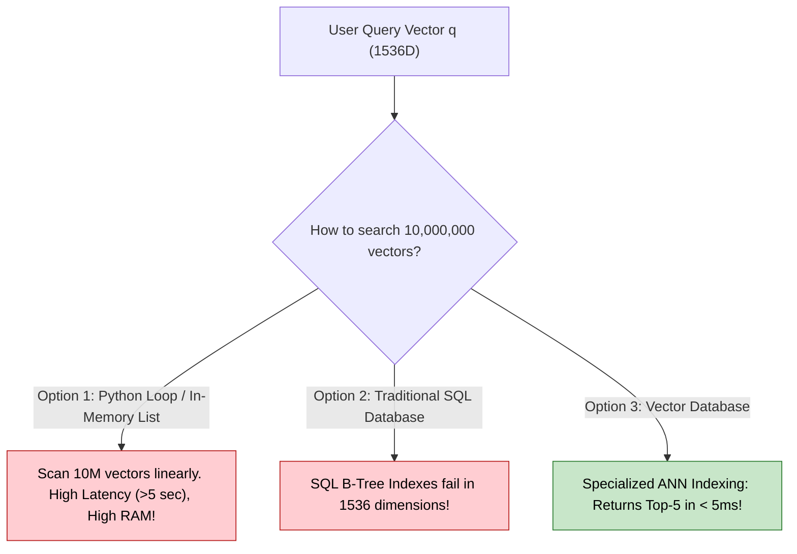
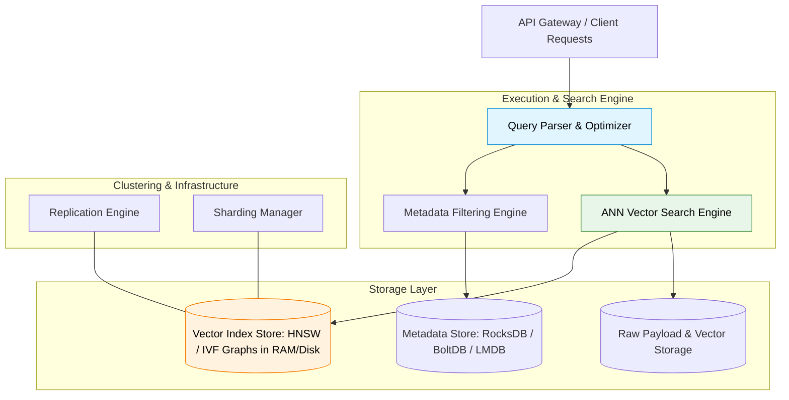
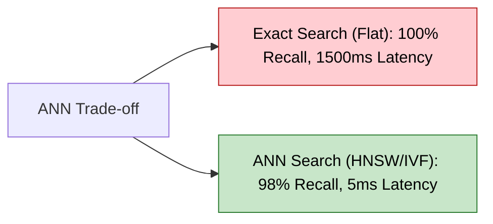

# Module 5 — Vector Databases & Approximate Nearest Neighbor (ANN) Search

> **Author:** Subramani V  
> **Part of:** RAG Complete Learning Roadmap — PART 1: RAG Foundations & Storage Infrastructure  
> **Goal:** Master Vector Databases, vector indexing, exact vs. approximate nearest neighbor search (ANN), graph/cluster indexing algorithms (HNSW, IVF, PQ, DiskANN, ScaNN), metadata filtering strategies, and complete RAG infrastructure integration.

---

## Why This Module Matters

In **Module 4**, we learned how text documents and user queries are transformed into continuous floating-point vectors in a high-dimensional space.

Now, a critical production infrastructure question emerges:

> **Where and how do we store millions or billions of 768-dimensional or 1536-dimensional vectors, and search across them in under 10 milliseconds?**

A standard Python array, JSON file, or relational database query cannot perform high-dimensional similarity searches at scale. **Vector Databases** and **Approximate Nearest Neighbor (ANN) search algorithms** are the core storage engines that make production RAG possible.

---

## Goal of this Module

By the end of this module, you will be able to answer with deep technical authority:

- What is a Vector Database, and why were traditional SQL/NoSQL databases insufficient for high-dimensional vectors?
- What is the difference between **Exact Search ($k$-NN)** and **Approximate Nearest Neighbor (ANN) Search**?
- Why does brute-force $k$-NN search fail as vector datasets grow into millions of documents?
- How does **HNSW (Hierarchical Navigable Small World)** construct multi-layer graphs for $O(\log N)$ search latency?
- How does **IVF (Inverted File Index)** partition vector space into Voronoi cells?
- How does **Product Quantization (PQ)** compress vectors to fit massive datasets into RAM?
- How do **DiskANN** and **ScaNN** handle billion-scale search on SSDs and GPUs?
- What is the difference between **Pre-filtering**, **Post-filtering**, and **Single-Stage (Iterative) Metadata Filtering**?
- How do **Pinecone**, **Weaviate**, **Milvus**, **Qdrant**, **Chroma**, **FAISS**, and **pgvector** compare?
- How does the Vector DB fit into the complete end-to-end RAG architecture?

---

## Module Structure

```text
PART A — Foundations & Vector Database Architecture
  5.1  Why Were Vector Databases Invented?
  5.2  Traditional Database vs. Vector Database
  5.3  What is a Vector Database?
  5.4  Vector Database Internal Architecture

PART B — Vector Search Mechanics & Scale Challenges
  5.5  Exact Search (Brute-Force k-NN)
  5.6  Nearest Neighbor Search Intuition
  5.7  Why Exact Search Fails at Scale
  5.8  Approximate Nearest Neighbor (ANN) & The Recall-Latency Trade-Off

PART C — ANN Indexing Algorithms & Data Structures
  5.9  What is a Vector Index?
  5.10 HNSW (Hierarchical Navigable Small World)
  5.11 IVF (Inverted File Index)
  5.12 Product Quantization (PQ)
  5.13 Combined Indexes: IVF-PQ & HNSW-PQ
  5.14 DiskANN & ScaNN (Billion-Scale Vector Search)

PART D — Advanced Features & Operations
  5.15 Metadata Filtering Strategies (Pre, Post, Iterative)
  5.16 Hybrid Search Integration (BM25 + Vector + RRF)
  5.17 CRUD Operations in Vector Databases
  5.18 Popular Vector Databases Landscape & Feature Matrix

PART E — Vector Databases in the Complete RAG Pipeline
  5.19 Complete End-to-End RAG System Architecture
  5.20 Key Advantages of Vector Databases
  5.21 Limitations & Production Operations
  5.22 Conceptual Python Implementation from Scratch (Brute-Force vs. IVF Index)
  5.23 Common Industry Misconceptions
  5.24 Interview Questions & In-Depth Technical Answers
  5.25 Bridge to Module 6 (Document Processing & Chunking Strategies)
```

---

# PART A — Foundations & Vector Database Architecture

## 5.1 — Why Were Vector Databases Invented?

Suppose an enterprise processes a library of **10,000,000 document passages**.

Using an embedding model like `text-embedding-3-small` (1,536 dimensions), every passage becomes a vector:

$$\mathbf{v}_i \in \mathbb{R}^{1536} \quad \text{for } i = 1, 2, \dots, 10,000,000$$

Each vector consists of 1,536 32-bit floating-point numbers (4 bytes per float):

$$\text{Memory per vector} = 1536 \times 4 \text{ bytes} \approx 6.144 \text{ KB}$$

$$\text{Raw storage for 10M vectors} = 10,000,000 \times 6.144 \text{ KB} \approx 61.44 \text{ GB}$$

Now, a user submits a question:

> *"What is our company policy on remote work expense reimbursements?"*

The system embeds the question into a 1,536-dimensional query vector $\mathbf{q}$.

To answer the question, we must find the top 5 stored passage vectors $\mathbf{v}_i$ that have the highest **Cosine Similarity** to $\mathbf{q}$.



Traditional databases were engineered for **exact matching** on 1D/2D structured fields (numbers, dates, text strings). They possess no native capabilities to index high-dimensional spaces or perform similarity searches. 

**Vector Databases were invented to solve this high-dimensional search and storage problem.**

---

## 5.2 — Traditional Database vs. Vector Database

To understand Vector Databases, contrast them against traditional Relational (SQL) and Document (NoSQL) databases:

```text
                           TRADITIONAL DB vs VECTOR DB
┌─────────────────────────────────────────┬─────────────────────────────────────────┐
│          TRADITIONAL SQL / NOSQL        │              VECTOR DATABASE            │
├─────────────────────────────────────────┼─────────────────────────────────────────┤
│ Data Model: Structured tables, JSON     │ Data Model: Dense numerical vectors +   │
│ documents, key-value pairs.             │ unstructured chunk text + metadata.     │
│                                         │                                         │
│ Indexing Structure: B-Trees, Hash       │ Indexing Structure: HNSW Graphs, IVF    │
│ Indexes, Inverted Indexes.              │ Clusters, Quantized Codebooks.          │
│                                         │                                         │
│ Search Paradigm: Exact Matching         │ Search Paradigm: Similarity Matching    │
│ (WHERE age = 30 AND dept = 'HR').       │ (Find Top-K nearest vectors to query q).│
│                                         │                                         │
│ Result Criterion: Deterministic boolean │ Result Criterion: Probabilistic rank    │
│ match (True / False).                   │ by distance metric (Cosine, Dot, L2).   │
│                                         │                                         │
│ Scaling Axis: Vertical (RAM/CPU) &      │ Scaling Axis: Multi-node sharding, GPU  │
│ Horizontal sharding by Partition Key.   │ acceleration, ANN Quantization.         │
└─────────────────────────────────────────┴─────────────────────────────────────────┘
```

---

## 5.3 — What is a Vector Database?

Here is the formal architectural definition:

> **Definition:** A **Vector Database** is a specialized database system built to store, manage, index, and query high-dimensional vector representations efficiently using similarity metrics (Cosine, Dot Product, Euclidean Distance) at sub-second latencies across millions or billions of records.

A production Vector Database handles **three core responsibilities**:

1. **Storage Management:** Manages raw vectors, document payloads, metadata, and index structures across RAM, SSDs, and disk caches.
2. **Indexing Operations:** Builds and maintains fast Approximate Nearest Neighbor (ANN) index structures (graphs, trees, cluster partitions).
3. **Query Engine:** Executes fast similarity searches, combines metadata pre/post-filtering, supports CRUD operations, and scales horizontally via sharding and replication.

---

## 5.4 — Internal Architecture of a Vector Database

A production-grade Vector Database (such as Qdrant, Milvus, Weaviate, or Pinecone) consists of four primary internal layers:



1. **API & Interface Layer:** Accepts REST, gRPC, or GraphQL requests from RAG application clients.
2. **Query Optimizer:** Parses incoming query vectors, evaluates metadata filter clauses, and chooses the optimal index traversal execution path.
3. **ANN Vector Indexing Engine:** Traverses graphs (HNSW) or partitions (IVF) to compute vector distances against candidate subsets.
4. **Persistent Storage Engine:** Manages atomic commits, Write-Ahead Logs (WAL), metadata tables, raw text chunk payloads, and disk-backed index snapshots.

---

# PART B — Searching Vectors

## 5.5 — Exact Search (Brute-Force $k$-NN)

The simplest vector search method is **Exact Search** (also called **Flat Index** or **Brute-Force $k$-Nearest Neighbors**).

```text
                               EXACT SEARCH (FLAT INDEX)
┌──────────────────────────────────────────────────────────────────────────────────┐
│                                                                                  │
│   Query Vector (q) ───► Compare against Vector 1 (v_1)  ──► Distance = 0.85     │
│                    ───► Compare against Vector 2 (v_2)  ──► Distance = 0.12     │
│                    ───► Compare against Vector 3 (v_3)  ──► Distance = 0.94     │
│                    ...                                                           │
│                    ───► Compare against Vector N (v_N)  ──► Distance = 0.43     │
│                                                                                  │
│   SORT ALL N DISTANCES ──► RETURN EXACT TOP-K NEAREST VECTORS                    │
│                                                                                  │
└──────────────────────────────────────────────────────────────────────────────────┘
```

### Time Complexity Formula
To find the top-$k$ nearest neighbors for a single query vector $\mathbf{q} \in \mathbb{R}^d$ across $N$ stored vectors:

$$\text{Time Complexity} = O(N \cdot d + N \log k)$$

Where:
- $N$ is the total number of vectors in the database.
- $d$ is the dimensionality of the vector space.
- $k$ is the number of top results requested.

### Advantages & Disadvantages
- **Advantage:** **100% Recall Accuracy.** Guarantees finding the absolute closest vectors in space.
- **Disadvantage:** Does **NOT scale**. As $N$ grows to 10M+, query latency explodes linearly.

---

## 5.6 — Nearest Neighbor Search Intuition

Imagine high-dimensional vector space as a 3D night sky where every star represents a document chunk:

```text
                        NEAREST NEIGHBOR GEOMETRY
                                 
                                  * Doc C
                       * Doc A   / 
                                / (Distance = 0.12)
                     * Doc B   /
                           \  /
                            [Query *]
                                \
                                 \ (Distance = 0.89)
                                  * Doc D
```

The **Nearest Neighbor Search** task asks: *"Given a new target coordinate $[Query *]$, which $k$ stars lie within the smallest distance radius?"*

- **Doc A, Doc B, Doc C** fall within the close neighbourhood $\rightarrow$ **Retrieved as Top-K**.
- **Doc D** lies far across the galaxy $\rightarrow$ **Ignored**.

---

## 5.7 — Why Exact Search Fails at Scale

Let's calculate the computational load of Exact Search at scale:

| Dataset Size ($N$) | Dimensionality ($d$) | Calculations per Query | Latency (Single Thread CPU) | Latency (100 Concurrent Users) |
| :---: | :---: | :---: | :---: | :---: |
| **10,000** | 1,536 | 15.36 Million ops | ~2 ms | ~50 ms |
| **1,000,000** | 1,536 | 1.53 Billion ops | ~150 ms | ~15 seconds ⚠️ |
| **10,000,000** | 1,536 | 15.36 Billion ops | ~1.5 seconds ❌ | **Server Collapse** ❌ |
| **100,000,000** | 1,536 | 153.6 Billion ops | ~15 seconds ❌ | **Unusable** ❌ |

At production scale (1M to 1B+ vectors), brute-force linear search is mathematically impossible for real-time applications.

---

## 5.8 — Approximate Nearest Neighbor (ANN) & The Recall-Latency Trade-Off

To overcome the linear scaling wall, production systems use **Approximate Nearest Neighbor (ANN)** algorithms.

> **The Core ANN Philosophy:** Instead of spending seconds searching 100% of the vector space to guarantee 100% accuracy, **trade a 1–5% accuracy margin for a 100x–1000x speedup.**



### The Recall@K Metric
ANN quality is measured using **Recall@K**:

$$\text{Recall@K} = \frac{|\text{Top-K vectors returned by ANN search} \cap \text{Top-K vectors returned by Exact search}|}{K}$$

- **Recall@K = 1.0 (100%):** ANN found the exact same top-$k$ results as brute force.
- **Recall@K = 0.95 (95%):** 19 out of 20 retrieved chunks match the true nearest neighbors. In RAG applications, 95%+ recall is virtually indistinguishable from 100% in generation quality!

---

# PART C — ANN Indexing Algorithms & Data Structures

## 5.9 — What is a Vector Index?

An **Index** is a data structure constructed over raw vector data that organizes vectors into navigable sub-structures (graphs, tree hierarchies, clusters, or compressed representations).

Just as a book index lets you jump to Page 214 without reading Pages 1–213, a **Vector Index** allows a query to evaluate **only 0.1% to 1% of total vectors** to locate the nearest neighbors.

---

## 5.10 — HNSW (Hierarchical Navigable Small World)

**HNSW** is currently the state-of-the-art graph-based ANN indexing algorithm used by default in Qdrant, Weaviate, Pinecone, and pgvector.

### Architectural Concept
HNSW draws inspiration from the **Skip-List** data structure and **Small-World Graph** networks (the "Six Degrees of Separation" concept). It constructs a multi-layer graph hierarchy:

```text
                            HNSW MULTI-LAYER GRAPH
┌──────────────────────────────────────────────────────────────────────────────────┐
│                                                                                  │
│   Layer 2 (Coarse/Sparse):    ● ─────────────────────────── ► ● (Long jumps)     │
│                               │                               │                  │
│   Layer 1 (Medium):           ● ─────────── ► ● ───────────── ► ● (Medium jumps)   │
│                               │               │               │                  │
│   Layer 0 (Dense/All Nodes):  ● ──► ● ──► ● ──► ● ──► ● ──► ● ──► ● (Local links)  │
│                                                                                  │
└──────────────────────────────────────────────────────────────────────────────────┘
```

### How HNSW Search Works:
1. **Entry at Top Layer (Layer 2):** Query enters at a sparse layer with long-distance node connections. It takes large "coarse" jumps toward the query coordinate.
2. **Descending Layers:** When no closer neighbor can be found on Layer 2, search drops down to Layer 1 at the closest node coordinate.
3. **Local Navigation at Base Layer (Layer 0):** On Layer 0 (containing all vectors), the algorithm performs fine-grained local navigation to return the top-$k$ nearest vectors.

### Search Complexity
$$\text{HNSW Search Time Complexity} = O(\log N)$$

### HNSW Key Hyperparameters
- **`M`:** Maximum number of bidirectional connections (edges) per node in the graph (typical: 16 to 64). Higher `M` $\rightarrow$ higher recall, higher RAM usage.
- **`efConstruction`:** Size of dynamic candidate list evaluated during index creation. Higher $\rightarrow$ slower index build, better search quality.
- **`efSearch`:** Size of dynamic candidate list evaluated during query execution. Higher $\rightarrow$ higher recall, higher query latency.

---

## 5.11 — IVF (Inverted File Index)

**IVF** is a partition-based indexing algorithm created to handle massive datasets with smaller RAM footprints (pioneered in Meta's FAISS library).

### Architectural Concept
IVF partitions the high-dimensional vector space into $K$ distinct geometric regions called **Voronoi Cells** using $k$-means clustering.

```text
                         IVF VORONOI PARTITIONING
┌──────────────────────────────────────────────────────────────────────────────────┐
│                                                                                  │
│            Cluster Centroid 1 (c_1)           Cluster Centroid 2 (c_2)           │
│           ┌────────────────────────┐         ┌────────────────────────┐          │
│           │  • v_1   • v_2   • v_3 │         │  • v_4   • v_5   • v_6 │          │
│           └────────────────────────┘         └────────────────────────┘          │
│                                   \           /                                  │
│                                    [Query q]                                     │
│                                       │                                          │
│                       Cluster Centroid 3 (c_3)                                   │
│                      ┌────────────────────────┐                                  │
│                      │  • v_7   • v_8   • v_9 │                                  │
│                      └────────────────────────┘                                  │
│                                                                                  │
└──────────────────────────────────────────────────────────────────────────────────┘
```

### How IVF Search Works:
1. **Identify Centroids:** Given query $\mathbf{q}$, compute distance against only the $K$ cluster centroids ($c_1, c_2, \dots, c_K$).
2. **Select Probe Clusters (`nprobe`):** Pick the `nprobe` closest centroids (e.g., `nprobe=2`).
3. **Inverted List Search:** Search *only* the vectors contained inside those selected clusters! Ignore the remaining 95%+ of vectors in unselected clusters.

### Key Hyperparameters
- **`nlist`:** Total number of Voronoi clusters created during index training (e.g., `nlist=1024`).
- **`nprobe`:** Number of adjacent clusters inspected during search (e.g., `nprobe=8`).

> [!WARNING]
> If `nprobe` is set too low (e.g., `nprobe=1`), vectors lying near the border of an adjacent cluster might be missed, dropping recall.

---

## 5.12 — Product Quantization (PQ)

While HNSW and IVF speed up search, high-dimensional vectors still consume massive RAM. **Product Quantization (PQ)** is a lossy vector compression technique designed to shrink memory footprint by 80% to 95%.

### How PQ Vector Compression Works:

```text
                        PRODUCT QUANTIZATION (PQ)
┌──────────────────────────────────────────────────────────────────────────────────┐
│                                                                                  │
│  Original Vector (128 Dimensions, 32-bit floats = 512 Bytes):                    │
│  [ 0.12, -0.45, ..., 0.88 | 0.33, 0.11, ..., -0.09 | ... | -0.71, ..., 0.04 ]    │
│  └────── Sub-vector 1 ────┴────── Sub-vector 2 ────┴─────┴──── Sub-vector M ────┘ │
│                                                                                  │
│  COMPRESSION:                                                                    │
│  1. Divide 128D vector into M=8 sub-vectors (16 dimensions each).                │
│  2. Run K-Means on each sub-vector subspace to create 256 Codebook Centroids.     │
│  3. Replace each 16D sub-vector with an 8-bit Byte ID (0 to 255).                 │
│                                                                                  │
│  Compressed Vector Representation = [ ID_1, ID_2, ID_3, ID_4, ID_5, ID_6, ID_7, ID_8 ] │
│  Memory Footprint = 8 Bytes (vs 512 Bytes originally -> 64x Compression!)        │
│                                                                                  │
└──────────────────────────────────────────────────────────────────────────────────┘
```

---

## 5.13 — Combined Indexes: IVF-PQ & HNSW-PQ

In enterprise production deployments, indexing techniques are combined:

- **IVF-PQ (Inverted File + Product Quantization):**
  - Uses IVF to partition space into clusters, and PQ to compress vectors inside each cluster.
  - Used in FAISS and Milvus for searching billions of vectors on cost-effective hardware.
- **HNSW-PQ:**
  - Constructs an HNSW graph structure while compressing node vectors using PQ.
  - Keeps graph navigation in RAM while reducing memory requirements by 75%+.

---

## 5.14 — DiskANN & ScaNN (Billion-Scale Vector Search)

When dataset scales reach billions of vectors (exceeding terabytes of RAM):

1. **DiskANN (Microsoft Research):**
   - Designed to store compressed vector indexes primarily on fast NVMe SSDs rather than expensive RAM.
   - Achieves sub-10ms latencies over 1 Billion vectors using compressed graph links on disk with an in-RAM cache.
2. **ScaNN (Google Research):**
   - **Scalable Nearest Neighbors** utilizes **Anisotropic Vector Quantization**, which optimizes vector compression specifically to preserve Cosine/Dot Product directional accuracy rather than standard Euclidean distance.

---

# PART D — Advanced Features & Operations

## 5.15 — Metadata Filtering Strategies (Pre, Post, Iterative)

In production RAG, queries are rarely pure vector searches. They almost always include structured business metadata filters:

> *"Find top 3 policy passages similar to 'maternity leave', WHERE department = 'HR' AND country = 'USA' AND year >= 2025."*

How does a Vector Database combine vector distance with metadata filter constraints?

```mermaid
graph TD
    subgraph Strategy 1: Post-Filtering (Flawed)
        A1[Perform Pure Vector Search -> Top 100] --> B1[Apply Filter: dept='HR']
        B1 -->|Problem: If only 2 docs match filter| C1["Result: Only 2 docs returned instead of requested K=5!"]
    end

    subgraph Strategy 2: Pre-Filtering (Naive)
        A2[SQL Filter: dept='HR' -> Fetch 50,000 IDs] --> B2[Perform Brute Force Vector Search over 50k IDs]
        B2 -->|Problem: Bypasses HNSW graph index -> Slow!| C2[High Latency]
    end

    subgraph Strategy 3: Single-Stage Iterative Filtering (Modern Standard)
        A3[Traverse HNSW Graph] --> B3{"Is candidate node dept='HR'?"}
        B3 -->|Yes| C3[Keep Node & Continue Graph Traversal]
        B3 -->|No| D3[Skip Node Payload & Follow Graph Edges]
        C3 --> E3["Guaranteed Top-K Valid Results at Logarithmic Speed!"]
    end

    style C1 fill:#ffcdd2,stroke:#b71c1c,color:#000
    style C2 fill:#ffcdd2,stroke:#b71c1c,color:#000
    style E3 fill:#c8e6c9,stroke:#2e7d32,color:#000
```

> [!IMPORTANT]
> **Production Benchmark:** Modern Vector DBs (Qdrant, Pinecone, Weaviate) use **Single-Stage Iterative Filtering (Acorn / Filtered HNSW)**, inspecting metadata flags directly while traversing the graph structure.

---

## 5.16 — Hybrid Search Integration (BM25 + Vector + RRF)

As established in **Module 2**, keyword search (BM25) and vector search excel at different tasks:

- **BM25 Lexical Search:** Excels at exact term matching, serial numbers (`ERR-9021`), product IDs, and rare proper nouns.
- **Dense Vector Search:** Excels at synonyms, conceptual intent, and semantic matching.

Modern Vector Databases natively perform **Hybrid Search** by executing both searches in parallel and fusing their rank lists using **Reciprocal Rank Fusion (RRF)**:

$$\text{RRF Score}(d \in D) = \sum_{m \in M} \frac{1}{k + r_m(d)}$$

Where $r_m(d)$ is the rank of document $d$ in search system $m$, and $k$ is a smoothing constant (typically $k=60$).

---

## 5.17 — CRUD Operations in Vector Databases

Vector Databases support full **CRUD (Create, Read, Update, Delete)** lifecycles:

1. **Create / Upsert:** Inserts new document vectors, text payloads, and metadata into the index.
2. **Read / Query:** Executes ANN vector similarity search with optional metadata filter payloads.
3. **Update:** Overwrites an existing vector and payload when source document content is edited.
4. **Delete:** Removes vector nodes and updates graph edge links.

> [!CAUTION]
> **Index Maintenance:** Frequent deletes and updates cause graph degradation (orphaned nodes) in HNSW indexes. Production Vector DBs execute background graph consolidation and re-indexing jobs automatically.

---

## 5.18 — Popular Vector Databases Landscape & Feature Matrix

| Vector DB | Deployment Type | Indexing Support | Filtering Strategy | Best Used For |
| :--- | :--- | :--- | :--- | :--- |
| **Pinecone** | Fully Managed Cloud | Proprietary HNSW variant | Single-stage payload filter | Serverless enterprise RAG, zero infra ops |
| **Qdrant** | Open Source / Cloud | HNSW | Payload HNSW pre-filter | High-performance, Rust-based, rich filtering |
| **Weaviate** | Open Source / Cloud | HNSW, HNSW-PQ | Inverted Index payload filter| Multi-modal RAG, GraphQL, native modules |
| **Milvus** | Open Source / Cloud | HNSW, IVF-PQ, DiskANN | Scalar filtering | Massive enterprise scale (100M+ vectors) |
| **Chroma** | Open Source (Local) | HNSW (via hnswlib) | Metadata filtering | Rapid prototyping, local Python RAG apps |
| **FAISS** | C++ / Python Library | Flat, IVF, PQ, HNSW | Manual post-filtering | Custom ML research pipelines, raw speed |
| **pgvector** | PostgreSQL Extension| HNSW, IVFFlat | Native SQL WHERE filters | Projects already running on PostgreSQL |

---

# PART E — Vector Databases in the Complete RAG Pipeline

## 5.19 — Complete End-to-End RAG System Architecture

Let's look at the complete architecture connecting everything learned across Modules 1 to 5:

```mermaid
flowchart TD
    subgraph Offline Ingestion Pipeline
        Doc[PDF / Office / Text Docs] --> Parser[Document Loader & Parser]
        Parser --> Chunker[Chunking Engine]
        Chunker --> Embedder[Embedding Model]
        Embedder -->|Vectors + Text + Metadata| VDB[(Vector Database)]
    end

    subgraph Online Retrieval & Generation Pipeline
        User([User Question]) --> QEmbedder[Embedding Model]
        QEmbedder -->|Query Vector q| VDB Engine
        
        subgraph VDB Engine
            VDB[(Vector Database)] --> ANN[ANN Graph / Cluster Traversal]
            ANN --> Filter[Metadata Filter Evaluation]
            Filter --> TopK[Top-K Document Chunks]
        end
        
        TopK --> PromptPrep[Prompt Construction Engine]
        User --> PromptPrep
        PromptPrep -->|Augmented Prompt| LLM[LLM Generator]
        LLM --> Answer([Grounded Response + Citations])
    end

    style VDB fill:#fff3e0,stroke:#f57c00,color:#000
    style LLM fill:#e1f5fe,stroke:#0288d1,color:#000
    style Answer fill:#c8e6c9,stroke:#2e7d32,color:#000
```

> [!IMPORTANT]
> **Crucial RAG Architectural Reality:** The **LLM never directly communicates with or searches the Vector Database**. The **Retriever Engine** queries the Vector Database, extracts relevant context chunks, formats the augmented prompt, and feeds the prompt to the LLM.

---

## 5.20 — Key Advantages of Vector Databases

1. **Sub-Second Semantic Retrieval:** Searches millions of vectors in under 10 milliseconds.
2. **Horizontal Scalability:** Distributes vector indices across sharded clusters.
3. **Rich Metadata Integration:** Filters vectors by tenant ID, access permissions, creation date, or document category during traversal.
4. **Real-time Ingestion:** Supports continuous upserts without full database re-indexing.
5. **Hybrid Search Synergy:** Merges keyword search and dense vector search into unified rank results.

---

## 5.21 — Limitations & Production Operations

1. **Memory Intensity:** High-recall HNSW indexes require vast amounts of RAM.
2. **Index Building Latency:** Ingesting 10 million vectors can take hours of CPU/GPU compute time to build graph structures.
3. **Approximate Nature:** ANN algorithms trade off 1–5% accuracy margin for speed.
4. **Garbage In, Garbage Out:** If document chunking or embedding models produce low-quality representations, the Vector DB will return irrelevant results.

---

## 5.22 — Conceptual Python Implementation from Scratch

Here is a pure Python script demonstrating **Exact Brute-Force Search vs. Inverted File (IVF) Cluster Search** from scratch:

```python
"""
Conceptual Vector Search: Exact Flat Search vs. IVF (Inverted File) Cluster Indexing
Exemplifying Voronoi partitioning, cluster probing, and ANN search logic from scratch.
"""

import math
import random
from typing import List, Tuple, Dict

# Set random seed for reproducibility
random.seed(42)

# ==========================================
# 1. MATHEMATICAL HELPERS
# ==========================================

def cosine_similarity(v1: List[float], v2: List[float]) -> float:
    dot = sum(a * b for a, b in zip(v1, v2))
    mag1 = math.sqrt(sum(a ** 2 for a in v1))
    mag2 = math.sqrt(sum(b ** 2 for b in v2))
    if mag1 == 0.0 or mag2 == 0.0:
        return 0.0
    return dot / (mag1 * mag2)

def generate_random_vector(dim: int = 16) -> List[float]:
    """Generates a random normalized vector of dimension `dim`."""
    raw = [random.gauss(0, 1) for _ in range(dim)]
    mag = math.sqrt(sum(x ** 2 for x in raw))
    return [x / mag for x in raw]

# ==========================================
# 2. EXACT SEARCH ENGINE (FLAT INDEX)
# ==========================================

class ExactSearchEngine:
    def __init__(self, vectors: List[Dict]):
        self.vectors = vectors

    def search(self, query_vec: List[float], top_k: int = 3) -> Tuple[List[Dict], int]:
        distance_evaluations = 0
        scored_vectors = []
        
        for doc in self.vectors:
            sim = cosine_similarity(query_vec, doc["vector"])
            distance_evaluations += 1
            scored_vectors.append((sim, doc))
            
        scored_vectors.sort(key=lambda x: x[0], reverse=True)
        return [doc for score, doc in scored_vectors[:top_k]], distance_evaluations


# ==========================================
# 3. ANN SEARCH ENGINE (IVF - INVERTED FILE INDEX)
# ==========================================

class IVFIndexEngine:
    def __init__(self, vectors: List[Dict], nlist: int = 4):
        self.vectors = vectors
        self.nlist = nlist
        self.centroids: List[List[float]] = []
        self.clusters: Dict[int, List[Dict]] = {i: [] for i in range(nlist)}
        self._build_index()

    def _build_index(self):
        # Step A: Pick `nlist` random vectors as initial cluster centroids
        dim = len(self.vectors[0]["vector"])
        sample_centroids = random.sample(self.vectors, self.nlist)
        self.centroids = [doc["vector"] for doc in sample_centroids]

        # Step B: Assign every vector in database to its closest centroid
        for doc in self.vectors:
            best_cluster_id = 0
            best_sim = -1.0
            for cluster_id, centroid in enumerate(self.centroids):
                sim = cosine_similarity(doc["vector"], centroid)
                if sim > best_sim:
                    best_sim = sim
                    best_cluster_id = cluster_id
            self.clusters[best_cluster_id].append(doc)

    def search(self, query_vec: List[float], top_k: int = 3, nprobe: int = 1) -> Tuple[List[Dict], int]:
        distance_evaluations = 0

        # Step 1: Find closest centroid(s) (Inspect nprobe clusters)
        centroid_scores = []
        for cluster_id, centroid in enumerate(self.centroids):
            sim = cosine_similarity(query_vec, centroid)
            distance_evaluations += 1
            centroid_scores.append((sim, cluster_id))
            
        centroid_scores.sort(key=lambda x: x[0], reverse=True)
        selected_clusters = [cluster_id for score, cluster_id in centroid_scores[:nprobe]]

        # Step 2: Search ONLY inside selected Voronoi clusters
        candidate_vectors = []
        for cid in selected_clusters:
            for doc in self.clusters[cid]:
                sim = cosine_similarity(query_vec, doc["vector"])
                distance_evaluations += 1
                candidate_vectors.append((sim, doc))

        candidate_vectors.sort(key=lambda x: x[0], reverse=True)
        return [doc for score, doc in candidate_vectors[:top_k]], distance_evaluations


# ==========================================
# 4. DEMONSTRATION & PERFORMANCE BENCHMARK
# ==========================================

if __name__ == "__main__":
    DIMENSION = 16
    NUM_VECTORS = 1000
    
    print(f"=== CREATING SYNTHETIC VECTOR DATABASE ({NUM_VECTORS} Vectors, {DIMENSION}D) ===")
    dataset = [
        {"id": f"doc_{i}", "vector": generate_random_vector(DIMENSION)}
        for i in range(NUM_VECTORS)
    ]
    query = generate_random_vector(DIMENSION)

    # Run Exact Search
    exact_engine = ExactSearchEngine(dataset)
    exact_results, exact_evals = exact_engine.search(query, top_k=3)

    # Run IVF ANN Search (4 Clusters, probe 1 cluster)
    ivf_engine = IVFIndexEngine(dataset, nlist=10)
    ivf_results, ivf_evals = ivf_engine.search(query, top_k=3, nprobe=2)

    print("\n--- SEARCH COMPARISON RESULTS ---")
    print(f"Exact Search Distance Calculations : {exact_evals}")
    print(f"IVF ANN Search Distance Calculations: {ivf_evals}")
    print(f"Computational Reduction            : {((exact_evals - ivf_evals) / exact_evals) * 100:.1f}% Fewer Calculations!")

    print("\nExact Top Match ID:", exact_results[0]["id"])
    print("IVF Top Match ID  :", ivf_results[0]["id"])
    print("=== DEMONSTRATION COMPLETE ===")
```

---

## 5.23 — Common Industry Misconceptions

### Misconception 1: *"Vector Databases replace traditional SQL databases completely."*
❌ **False.** Vector DBs are specialized search engines. They do not replace ACID transactional databases (PostgreSQL, MySQL) for core business entity management, inventory, or billing records.

### Misconception 2: *"The LLM directly queries the Vector Database."*
❌ **False.** The LLM has zero knowledge of the database connection. An external **Retriever Engine** queries the database, extracts relevant text chunks, formats them into a prompt, and submits the prompt to the LLM.

### Misconception 3: *"HNSW always guarantees 100% nearest neighbor accuracy."*
❌ **False.** HNSW is an **Approximate** algorithm. Depending on `efSearch` parameters, it typically delivers 95–99% recall, occasionally missing the true 1st nearest neighbor in exchange for logarithmic search speed.

### Misconception 4: *"You can run vector search without indexing."*
❌ **False for production scale.** Un-indexed brute-force vector search requires scanning every vector linearly. At 1M+ vectors, un-indexed search causes application timeouts.

---

## 5.24 — Interview Questions & In-Depth Technical Answers

### Q1: What is a Vector Database, and why can't we use traditional SQL databases for vector search?
**Answer:**  
A Vector Database is a specialized database built to store, index, and query high-dimensional vectors via spatial distance metrics (Cosine, Dot Product, L2). Traditional SQL databases rely on B-Trees and equality/range indices designed for 1D scalar data. In 768+ dimensions, B-Trees break down due to the Curse of Dimensionality, forcing SQL databases into brute-force $O(N)$ table scans unless equipped with specialized ANN index extensions (like `pgvector`).

---

### Q2: Explain the trade-off between Exact Search ($k$-NN) and Approximate Nearest Neighbor (ANN) Search.
**Answer:**  
Exact Search compares a query vector against all $N$ database vectors, guaranteeing 100% recall accuracy at $O(N \cdot d)$ time complexity. At scale, this linear latency is unacceptable. ANN algorithms trade off a negligible fraction of accuracy (achieving 95–99% Recall@K) to deliver $O(\log N)$ or $O(\sqrt{N})$ search latencies using specialized data structures like graphs (HNSW) or Voronoi partitions (IVF).

---

### Q3: How does the HNSW (Hierarchical Navigable Small World) index work?
**Answer:**  
HNSW is a graph-based ANN index inspired by skip-lists. It constructs a multi-layer graph hierarchy where upper layers contain sparse long-range connections for fast, coarse-grained navigation across vector space, and lower layers contain dense local connections. Search begins at the top layer to locate the nearest region, then steps down layer-by-layer to fine-tune local nearest-neighbor discovery on the base layer in $O(\log N)$ time.

---

### Q4: Explain the difference between Pre-filtering, Post-filtering, and Single-Stage Iterative Filtering for metadata queries.
**Answer:**  
- **Post-filtering:** Executes vector search first to get Top-$K$ results, then applies metadata filters. Fails if the Top-$K$ candidates contain few matching items, returning fewer than $K$ results.
- **Pre-filtering:** Applies SQL metadata filter first, then performs vector search over matching IDs. Bypasses the HNSW graph index, resulting in slow brute-force evaluation over filtered subsets.
- **Single-Stage Iterative Filtering:** Evaluates metadata constraints *during* graph traversal, skipping invalid nodes while continuing to follow graph edges, ensuring fast and accurate Top-$K$ retrieval.

---

### Q5: What is Product Quantization (PQ), and why is it used?
**Answer:**  
Product Quantization is a lossy vector compression technique. It divides a high-dimensional vector (e.g., 128D) into $M$ smaller sub-vectors (e.g., 8 sub-vectors of 16D), clusters sub-vector spaces using $k$-means, and replaces each sub-vector with an 8-bit centroid byte ID. This shrinks vector memory footprints by up to 95%, enabling multi-billion vector indices to fit into RAM or fast cache memory.

---

### Q6: What is Hybrid Search, and how does Reciprocal Rank Fusion (RRF) combine search results?
**Answer:**  
Hybrid Search executes both keyword-based Lexical Search (BM25) and semantic Vector Search simultaneously. Because BM25 produces unbounded term-matching scores while vector engines produce bounded distance scores, raw score merging fails. Reciprocal Rank Fusion (RRF) combines them by ranking documents in each system independently and computing a fused score based on rank positions ($\frac{1}{k + r_{\text{BM25}}} + \frac{1}{k + r_{\text{Vector}}}$).

---

## Summary & Key Takeaways

```text
┌──────────────────────────────────────────────────────────────────────────────────┐
│                                KEY TAKEAWAYS                                     │
├────────────────────────────────────────────────────────────────────────────────┤
│ • Vector DBs store, index, and query high-dimensional embeddings efficiently.    │
│ • Exact Search (O(N)) fails at scale; ANN trades ~1-5% recall for 100x speed.   │
│ • HNSW uses multi-layer graphs for O(log N) search; IVF uses Voronoi clusters.   │
│ • Product Quantization (PQ) compresses vectors to reduce memory footprint by 90%+.│
│ • Single-stage iterative metadata filtering evaluates payload filters during ANN. │
│ • The LLM NEVER directly queries the Vector DB; the Retriever performs search.  │
└──────────────────────────────────────────────────────────────────────────────────┘
```

---

## What's Next?

We have now covered **Why RAG exists** (Module 1), **IR Foundations** (Module 2), **RAG Architecture** (Module 3), **Embeddings** (Module 4), and **Vector Databases** (Module 5).

Now we enter the **Document Ingestion Phase** of RAG:

### ➡️ **Module 6 — Document Processing & Chunking Strategies**

In Module 6, we will explore:
- Why raw documents (PDFs, Word docs, HTML) cannot be embedded directly.
- **Fixed-size**, **Recursive**, **Semantic**, **Hierarchical**, and **Parent-Child** chunking strategies.
- Choosing chunk sizes and chunk overlaps.
- Handling complex structures (tables, code, markdown headers, images).
- Metadata enrichment strategies.
